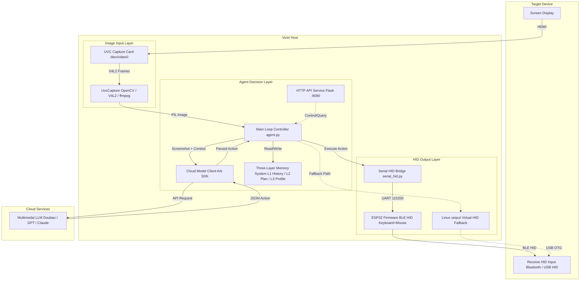

# Victrl

> [[中文](技术文档.md)|English]

This document describes Victrl's software implementation.

## Overall Architecture



Data flow summary:

1. USB capture card captures the target device's screen via HDMI
2. Agent assembles the screenshot with current task context (device profile, plan, history) and sends to the multimodal model
3. Model returns a JSON action instruction containing action type, coordinates, self-evaluation, plan updates, etc.
4. Agent parses the action and executes keyboard/mouse operations via ESP32 BLE HID (primary) or Linux uinput (fallback)
5. Waits for sufficient rendering time, then re-captures the screen — loop until task completion

---

## Image Input Layer

Responsibility: Capture screen display from the target device. Implemented in `core/uvc_capture.py`.

### Capture Backend Priority

1. **OpenCV V4L2** (primary) — handles MS2109 capture card edge cases thoroughly
2. **Pure Python V4L2** (fallback) — stdlib ioctl/mmap only, zero additional dependencies
3. **ffmpeg** (last resort) — subprocess JPEG snapshot

### MS2109 Capture Card Notes

MS2109 is Victrl's primary capture chip. Known issues:

- **USB Auto-Suspend**: Suspends after 2 seconds of idle. After wake-up, it outputs a color bar test pattern instead of the live feed. Requires a udev rule to set `power/control` to `on`.
- **VIDIOC_G_INPUT not supported**: MS2109 does not implement this ioctl, causing ffmpeg initialization to fail. The OpenCV backend skips this call.
- **MJPEG only**: At 1080p, only MJPEG format is output; YUYV is not supported.
- **Reopen VideoCapture each step**: LLM API calls take ~30 seconds, during which MS2109 stops isochronous transfers. Reusing an old VideoCapture handle returns stale frames. `grab_frame()` releases and rebuilds the VideoCapture on each step to ensure real-time frames.

---

## Agent Decision Layer

Responsibility: Core intelligent agent — manages memory, calls models, parses actions, and maintains task plans. Implemented in `core/agent.py`.

### Element Normalized Coordinates

Model output coordinates uniformly use the normalized format `[ymin, xmin, ymax, xmax]`, range 0~1, accurate to 3 decimal places.

For the doubao-seed model family, the Grounding prompt is:

```
Locate the "" in the image. Output strictly JSON format only, no extra explanation.
Use format: {"box_2d": [ymin, xmin, ymax, xmax], "label": ""}
All coordinates are normalized to 0-1 range and accurate to three decimal places.
```

Assuming the original image pixel dimensions are width `W` (x-axis), height `H` (y-axis):

| Parameter | Meaning | Pixel Conversion |
| --------- | ------- | ---------------- |
| ymin      | Box top edge (min vertical) | `ymin × H` |
| xmin      | Box left edge (min horizontal) | `xmin × W` |
| ymax      | Box bottom edge (max vertical) | `ymax × H` |
| xmax      | Box right edge (max horizontal) | `xmax × W` |

> Reference: https://qwen.ai/blog?id=qwen2.5-vl

Below is a pseudocode example of object detection and bounding box parsing:

```python
# 1. Encode image to Base64
def encode_image_to_base64(image_path):
    # Read image binary data
    # Encode to base64 string and return
    pass

# 2. Call vision API
def call_vision_api(api_key, image_path, prompt):
    # Convert image to base64
    # Construct request headers and body
    # Send POST request
    # Parse response, return recognition result
    pass

# 3. Parse target bounding box coordinates from API response
def parse_bbox_from_response(response_text):
    # Extract JSON string from response
    # Parse normalized box_2d coordinates
    # Return coordinates if parsing succeeds
    pass

def process_image(input_path, output_path, target_char, api_key):
    if response:
        # Parse bounding box coordinates
        bbox = parse_bbox_from_response(response)
        if bbox:
            # Convert normalized coordinates to pixel coordinates
            # Draw a red target bounding box on the original image
            cv2.rectangle(image, bbox_coords, red, line_width)

    # Save the final processed image
    cv2.imwrite(output_path, img)
```

Processed image examples:


> User prompt: "I want to Star this project, where should I click?"


> User prompt: "Where should I click if I want to find photography works?"

### Main Loop

Victrl relies entirely on a single multimodal model to handle all decisions — from task recognition and planning to step-by-step execution. The main process is responsible for:

```
Capture image → Call model → Parse JSON → Execute action → Wait for render → Repeat
```

The model autonomously decides whether it needs to look at the screen for each step (`need_screen`), and specifies the wait time after action execution (`sleep_before_next`) to accommodate rendering delays for different operations.

Current main loop implementation (simplified):

```python
while self.action_count < max_actions and not stop:
    # 1. Capture screen (reopen VideoCapture each step for real-time frame)
    if need_screen:
        img = self.capture.grab_frame()

    # 2. Assemble context and call model
    response = self.cloud.query(
        image=img,
        plan=self.plan,
        history=self.memory.get_recent(),
        profile_text=self.profile,
        last_summary=self.last_summary,
    )

    # 3. Parse action
    action = response["action_type"]
    sleep_before = response.get("sleep_before_next", 0.5)

    # 4. Execute action
    if action == "click":
        x, y = bbox_center(response["box_2d"])
        self.hid.mouse_click(x, y)
    elif action == "type":
        self.hid.type_string(response["text"])
    elif action == "press":
        self.hid.key_press(response["key"])
    # ... scroll, drag, wait, release, etc.

    # 5. Wait for target device to render
    time.sleep(max(sleep_before, 0.05))

    # 6. Update memory (L1 history + L2 plan + L3 profile)
    self.last_summary = response["plan_update"]["summary"]
    self.memory.add(response)
    self.plan = response["plan_update"]

    # 7. Check completion
    if response.get("done"):
        break

    need_screen = response.get("need_screen", True)
```

Each step's flow:

```
① Capture screen — Reopen VideoCapture for real-time frame (prevents MS2109 returning old frames after extended idle)
② Assemble context — System prompt + device profile + current milestone + recent history + screenshot
③ Call LLM — Model analyzes the screen, outputs JSON action instruction
④ Execute action — Parse action_type: click / type / press / scroll / drag / wait
⑤ Wait for render — sleep_before_next gives the target device enough time to react, preventing stale frames
⑥ Update memory — Action summary → L1, milestones → L2, new discoveries → L3
⑦ Check completion — When done=true, model must verify by capture to confirm goal achieved before exiting
```

### Model Response Format

Each step returns a complete JSON (current schema, defined in `SYSTEM_PROMPT` of `core/cloud_client.py`):

| Field | Type | Description |
| ----- | ---- | ----------- |
| `action_type` | string | click / move / drag / scroll / press / type / wait / release / complete / error |
| `box_2d` | [float×4] | Normalized coordinates [ymin, xmin, ymax, xmax], 3 decimal places |
| `from_box` / `to_box` | [float×4] | Start and end coordinates for drag actions |
| `button` | string | left / right / middle / double_left |
| `key` | string | Key combination, e.g. `ctrl+c`, `win+r`, joined with + |
| `text` | string | Text to input |
| `delta_x` / `delta_y` | int | Scroll amount |
| `wait_seconds` | float | Wait duration for wait action |
| `need_screen` | bool | Whether screen capture is needed for the next step |
| `sleep_before_next` | float | Wait time after this action (for target device rendering) |
| `observation` | string | What is currently seen on screen |
| `self_evaluation` | string | Whether the previous action achieved the expected result (required) |
| `plan_update` | object | Plan update (summary + milestones) |
| `profile_updates` | []object | New device knowledge discovered (appended to L3 profile) |
| `done` | bool | Whether the task is complete |
| `verification` | string | Evidence of completion when done=true |
| `message` | string | Explanation when completing or erroring |

Key design points:

- **Milestones, not steps**: The plan describes *what* to do; the model decides *how* based on what it sees on screen
- **observation / self_evaluation required**: Forces the model to describe what it sees and self-assess, preventing blind plan-following
- **verification required**: When done:true, must list completion evidence based on the latest screenshot

### Memory System

| Layer | Storage | File | Lifespan |
|-------|---------|------|----------|
| L1 Short-term | In-memory list | `memory/short_term.py` | Single task, keeps last N entries |
| L2 Plan | JSON file | `memory/plan_manager.py` | Single task, includes milestones, interruptible/resumable |
| L3 Profile | Markdown file | `memory/profile_manager.py` | Cross-task accumulation, records UI element positions, shortcuts, experience |

---

## HID Output Layer

Responsibility: Convert abstract actions decided by the Agent into real keyboard/mouse events and inject them into the target device.

Victrl supports two HID backends:

### Serial → ESP32 → BLE HID

Path: `serial_hid.py → UART → ESP32 → BLE HID → Target Device`

- Serial protocol at 115200 baud, one command per line
- ESP32 firmware `esp32_hid/esp32_hid.ino`, uses ESP32 built-in BLE libraries
- The target device searches for and pairs with "Victrl HID" via Bluetooth — after pairing, it appears as a standard Bluetooth keyboard + mouse
- Command format: `M x y` (mouse move), `C button` (click), `K combo` (key combo), `T base64` (text input), `S dx dy` (scroll), `R` (release)

Known constraints:
- Typing speed must not exceed ~40 chars/s (25ms/char), otherwise BLE GATT drops packets
- IME may intercept English character input as pinyin — the model has been instructed to be aware of this and adaptively switch

### Linux uinput

Path: `hid_controller.py → /dev/uinput → USB OTG → Target Device`

- Creates virtual keyboard/mouse devices via the Linux uinput subsystem
- Requires `sudo modprobe uinput`
- Connects directly to the target device via USB OTG cable

---

## HTTP API

Flask service listening on `127.0.0.1:8080` (`api/server.py`):

| Endpoint | Method | Description |
| -------- | ------ | ----------- |
| `/status` | GET | Returns current task status, action count, plan summary |
| `/start` | POST | Start a new task `{"task": "..."}` |
| `/stop` | POST | Stop the current task |
| `/profile` | GET | View device profile |
| `/plan` | GET | View current task plan |