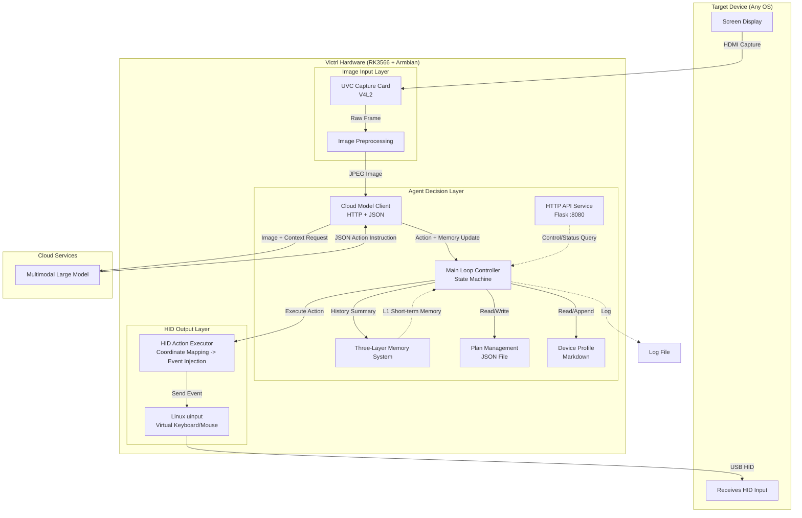
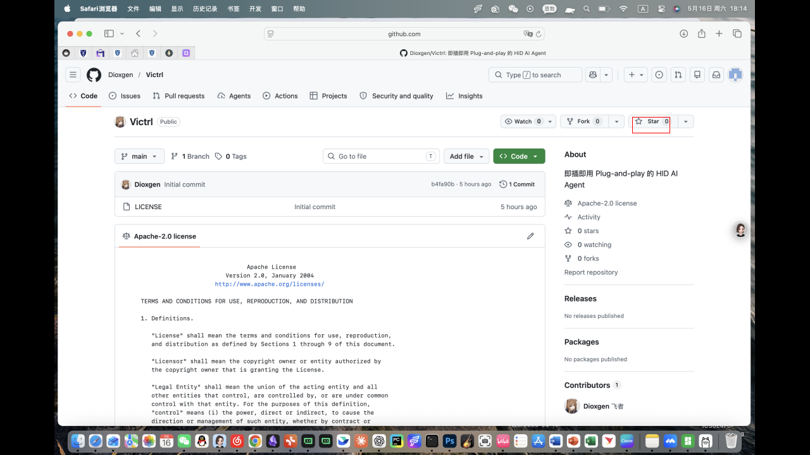
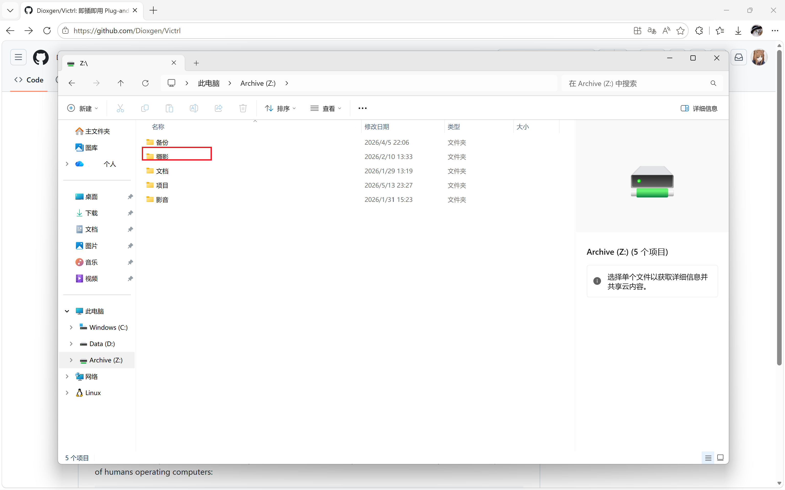

This document aims to provide an overview of Victrl's software implementation path.

## Overall Architecture:



Data flow summary:

1. Capture the target device's HDMI output via a USB capture card
2. Send the image (optional) along with the current task context to the multimodal model
3. The model returns a JSON instruction
4. The local HID executor simulates keyboard/mouse events
5. Loop until the task is completed or manually stopped

### Image Input Layer:

Responsibility: Capture the screen display from the target device and convert it into a format suitable for AI analysis.

### Agent Layer:

Responsibility: Core intelligent agent — manages memory, calls models, parses actions, and maintains task plans.

#### Element Normalized Coordinate Acquisition Test

Doubao-seed-2.0-mini is the primary model for this MVP system. Multimodal large models inherently possess precise visual localization capabilities; inaccurate coordinate localization is typically caused by mismatches in question format, coordinate order, normalization range, or model training data conventions.

For example, Qwen2.5-VL uses the following object detection JSON:

```Plain
{"bbox_2d": [x1, y1, x2, y2], "label": "", "sub_label": ""}
```

> Reference: https://qwen.ai/blog?id=qwen2.5-vl

For doubao-seed-2.0-mini, the Grounding prompt is:

```Plain
Locate the "" in the image. Output strictly JSON format only, no extra explanation.
Use format: {"box_2d": [ymin, xmin, ymax, xmax], "label": ""}
All coordinates are normalized to 0-1 range and accurate to three decimal places.
```

Assuming the original image pixel dimensions are: width `W` (horizontal, corresponding to the x-axis), height `H` (vertical, corresponding to the y-axis). The output coordinates are values normalized to the 0–1 range. The meaning and conversion formula for each parameter are:

| Parameter | Meaning (boundary position of the box)                          | Corresponding Pixel Coordinate Formula | Corresponding Image Direction    |
| --------- | --------------------------------------------------------------- | -------------------------------------- | -------------------------------- |
| ymin      | Top edge of the box (minimum vertical value, the topmost point) | ymin_pixel = ymin × H                  | Vertical (related to image H)    |
| xmin      | Left edge of the box (minimum horizontal value, the leftmost)   | xmin_pixel = xmin × W                  | Horizontal (related to image W)  |
| ymax      | Bottom edge of the box (maximum vertical value, the bottom)     | ymax_pixel = ymax × H                  | Vertical (related to image H)    |
| xmax      | Right edge of the box (maximum horizontal value, the rightmost) | xmax_pixel = xmax × W                  | Horizontal (related to image W)  |

Below is a pseudocode example of object detection and bounding box parsing:

```Python
# 1. Encode image to Base64
def encode_image_to_base64(image_path):
    # Read image binary data
    # Encode to base64 string and return
    pass

# 2. Call vision API
def call_vision_api(api_key, image_path, prompt):
    # Convert image to base64
    # Construct request headers and body
    # Send POST request
    # Parse response, return recognition result
    pass

# 3. Parse target bounding box coordinates from API response
def parse_bbox_from_response(response_text):
    # Extract JSON string from response
    # Parse normalized box_2d coordinates
    # Return coordinates if parsing succeeds
    pass

def process_image(input_path, output_path, target_char, api_key):
    if response:
        # Parse bounding box coordinates
        bbox = parse_bbox_from_response(response)
        if bbox:
            # Convert normalized coordinates to pixel coordinates
            # Draw a red target bounding box on the original image
            cv2.rectangle(image, bbox_coords, red, line_width)

    # Save the final processed image
    cv2.imwrite(output_path, img)
```

Processed image examples:



> User prompt: "I want to Star this project, where should I click?"



> User prompt: "Where should I click if I want to find photography works?"

#### Main Process

Victrl MVP relies entirely on a single multimodal model to make all decisions — from task recognition and planning to step-by-step execution. The main process is only responsible for: capturing images as requested by the model → calling the model → parsing JSON → executing actions → repeating. The model autonomously decides whether it needs to look at the screen for each step and what `action` to take, while maintaining an updatable `yyyyMMddHHmmss-plan` to track progress.

The loop does not use a fixed time interval; instead, it either runs back-to-back or lets the model autonomously specify the wait duration.

Below is a pseudocode example of the main process:

```Python
def run():
    plan = None
    history = []
    need_screen = True   # Must see screen on first iteration
    
    while True:
        # 1. Decide whether to capture based on need_screen
        image_b64 = capture_and_encode() if need_screen else None
        
        # 2. Call the model
        response = call_model(image=image_b64, plan=plan, history=history[-5:])
        
        # 3. Execute action
        if response.action_type == "click":
            x,y = bbox_to_center(response.box_2d, screen_width, screen_height)
            mouse_click(x,y)
        elif response.action_type == "type":
            keyboard_type(response.text)
        elif response.action_type == "wait":
            time.sleep(response.wait_seconds)
        elif response.action_type == "complete" or response.done:
            print("Task completed")
            break
        elif response.action_type == "error":
            print("Error:", response.message)
            break
        
        # 4. Record history
        history.append({"action": response.action_type, "result": "success"})
        
        # 5. Update plan
        plan = response.plan_update
        
        # 6. Handle profile_updates    
        self._append_to_profile(upd.get("content", ""))
            
        # 7. Set whether screen is needed for next round
        need_screen = response.need_screen
        
        # 8. Optional throttling
        time.sleep(0.5)   # Allow UI to settle
```

The JSON action set output by the model (partial):

| action_type | Description                              | Example Fields                   |
| ----------- | ---------------------------------------- | -------------------------------- |
| `click`     | Left-click at normalized coordinate area | `box_2d: [ymin,xmin,ymax,xmax]` |
| `move`      | Move mouse to specified area             | `box_2d`                         |
| `type`      | Input a string                           | `text: "Hello"`                  |
| `press`     | Press a key combination                  | `keys: ["ctrl","c"]`             |
| `scroll`    | Scroll                                   | `delta_x, delta_y`               |
| `wait`      | Wait for a number of seconds             | `seconds: 1.5`                   |
| `complete`  | Task completed successfully              | -                                |
| `error`     | Task failed with a reason                | `message`                        |

The model can also control whether an image is needed in the next round via `need_screen`, and adjust the wait time after an action via `sleep_before_next`, enabling an efficient, adaptive loop.

### HID Output Layer:

Responsibility: Convert the abstract actions decided by the Agent into real keyboard/mouse events and inject them into the target computer.

For 99% of desktop GUI automation tasks, HID emulation is fully sufficient. However, there are indeed a few edge cases that require special design.

Execution flow:

1. The Agent outputs a `click` action with normalized coordinates `[ymin, xmin, ymax, xmax]`
2. The HID layer maps the coordinates to screen pixels (`x = (xmin+xmax)/2 * screen_width`)
3. Move the mouse to the target point, send `BTN_LEFT` press/release events
4. Return the execution result