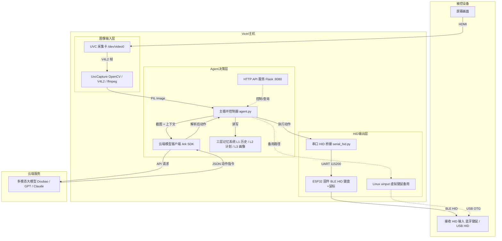

# Victrl

> [中文|[English](Technical Document.md)]

本文档介绍 Victrl 的软件实现。

## 整体架构



数据流简述：

1. USB 采集卡通过 HDMI 捕获被控设备画面
2. Agent 将截图及当前任务上下文（设备画像、计划、历史）组装后发送给多模态模型
3. 模型返回 JSON 动作指令，包含动作类型、坐标、自评、计划更新等
4. Agent 解析动作，通过 ESP32 BLE HID（主力）或 Linux uinput（备用）执行键鼠操作
5. 等待足够的渲染时间后重新采集画面，循环直至任务完成

---

## 图像输入层

职责：从被控设备捕获屏幕画面。当前实现 `core/uvc_capture.py`。

### 采集后端优先级

1. **OpenCV V4L2**（主力）— 完整处理 MS2109 采集卡的各种边界情况
2. **纯 Python V4L2**（回退）— 仅 stdlib ioctl/mmap，零额外依赖
3. **ffmpeg**（最后手段）— 子进程 JPEG 快照

### MS2109 采集卡注意事项

MS2109 是 Victrl 主力采集芯片，有以下已知问题：

- **USB 自动挂起**：空闲 2 秒后挂起，唤醒后输出彩条测试图而非实时画面。需通过 udev 规则将 `power/control` 设为 `on`。
- **VIDIOC_G_INPUT 不支持**：MS2109 不实现此 ioctl，ffmpeg 初始化会失败。OpenCV 后端跳过此调用。
- **仅 MJPEG**：1080p 下只输出 MJPEG 格式，不支持 YUYV。
- **每步重开 VideoCapture**：LLM API 调用约需 30 秒，期间 MS2109 停止等时传输。复用旧的 VideoCapture 句柄会返回过期帧。`grab_frame()` 每步释放并重建 VideoCapture，确保获取实时画面。

---

## Agent 决策层

职责：核心智能体，管理记忆、调用模型、解析动作、维护任务计划。当前实现 `core/agent.py`。

### 元素归一化坐标

模型输出的坐标统一使用归一化格式 `[ymin, xmin, ymax, xmax]`，范围 0~1，精确到 3 位小数。

对于 doubao-seed 系列模型，Grounding 提示词为：

```
Locate the "" in the image. Output strictly JSON format only, no extra explanation.
Use format: {"box_2d": [ymin, xmin, ymax, xmax], "label": ""}
All coordinates are normalized to 0-1 range and accurate to three decimal places.
```

假设原图像素尺寸为宽度 `W`（x 轴）、高度 `H`（y 轴）：

| 参数 | 含义 | 像素转换 |
| ---- | ---- | -------- |
| ymin | 框上边界（垂直方向最小值） | `ymin × H` |
| xmin | 框左边界（水平方向最小值） | `xmin × W` |
| ymax | 框下边界（垂直方向最大值） | `ymax × H` |
| xmax | 框右边界（水平方向最大值） | `xmax × W` |

> 参考文献：https://qwen.ai/blog?id=qwen2.5-vl

以下是目标检测并解析边框的一个伪代码示例：

```python
# 1. 图片编码为 Base64
def encode_image_to_base64(image_path):
    # 读取图片二进制数据
    # 编码为 base64 字符串并返回
    pass

# 2. 调用视觉 API
def call_vision_api(api_key, image_path, prompt):
    # 图片转 base64
    # 构造请求头、请求体
    # 发送POST请求
    # 解析响应，返回识别结果
    pass

# 3. 从 API 响应解析目标边框坐标
def parse_bbox_from_response(response_text):
    # 提取响应中的 JSON 字符串
    # 解析 box_2d 归一化坐标
    # 解析成功返回坐标
    pass

def process_image(input_path, output_path, target_char, api_key):
    if response:
        # 解析边框坐标
        bbox = parse_bbox_from_response(response)
        if bbox:
            # 归一化坐标转像素坐标
            # 在原图上绘制红色目标边框
            cv2.rectangle(图片, 边框坐标, 红色, 线宽)

    # 保存最终处理后的图片
    cv2.imwrite(output_path, img)
```

处理后的图片示例：


> 用户提示词：“我要 Star 这个项目，该点哪里？”


> 用户提示词：如果我想寻找摄影作品该点击哪里

### 主循环

Victrl 完全依赖单个多模态模型完成从任务识别、规划到逐步执行的所有决策。主进程负责：

```
采集图像 → 调用模型 → 解析 JSON → 执行动作 → 等待渲染 → 重复
```

模型自主决定每一步是否需要看屏幕（`need_screen`），并指定动作执行后的等待时间（`sleep_before_next`），以适应不同操作的渲染延迟。

当前主循环实现（简化）：

```python
while self.action_count < max_actions and not stop:
    # 1. 采集屏幕（每步重新打开 VideoCapture，确保实时帧）
    if need_screen:
        img = self.capture.grab_frame()

    # 2. 组装上下文并调用模型
    response = self.cloud.query(
        image=img,
        plan=self.plan,
        history=self.memory.get_recent(),
        profile_text=self.profile,
        last_summary=self.last_summary,
    )

    # 3. 解析动作
    action = response["action_type"]
    sleep_before = response.get("sleep_before_next", 0.5)

    # 4. 执行动作
    if action == "click":
        x, y = bbox_center(response["box_2d"])
        self.hid.mouse_click(x, y)
    elif action == "type":
        self.hid.type_string(response["text"])
    elif action == "press":
        self.hid.key_press(response["key"])
    # ... scroll, drag, wait, release 等

    # 5. 等待被控设备渲染
    time.sleep(max(sleep_before, 0.05))

    # 6. 更新记忆（L1 历史 + L2 计划 + L3 画像）
    self.last_summary = response["plan_update"]["summary"]
    self.memory.add(response)
    self.plan = response["plan_update"]

    # 7. 检查完成
    if response.get("done"):
        break

    need_screen = response.get("need_screen", True)
```

每一步的流程：

```
① 抓屏 — 重新打开 VideoCapture 获取实时帧（避免 MS2109 长时间空闲返回旧帧）
② 组装上下文 — 系统提示词 + 设备画像 + 当前里程碑 + 最近历史 + 截图
③ 调用 LLM — 模型分析画面，输出 JSON 动作指令
④ 执行动作 — 解析 action_type：click / type / press / scroll / drag / wait
⑤ 等待渲染 — sleep_before_next 给被控设备足够时间反应，防止下一帧拍到旧画面
⑥ 更新记忆 — 动作摘要 → L1，里程碑 → L2，新发现 → L3
⑦ 检查完成 — done=true 时需模型抓屏验证，确认目标达成方可退出
```

### 模型响应格式

每步返回完整 JSON（当前 schema，定义于 `core/cloud_client.py` 的 `SYSTEM_PROMPT`）：

| 字段 | 类型 | 说明 |
| ---- | ---- | ---- |
| `action_type` | string | click / move / drag / scroll / press / type / wait / release / complete / error |
| `box_2d` | [float×4] | 归一化坐标 [ymin, xmin, ymax, xmax]，精确 3 位小数 |
| `from_box` / `to_box` | [float×4] | drag 动作的起止坐标 |
| `button` | string | left / right / middle / double_left |
| `key` | string | 组合键，如 `ctrl+c`、`win+r`，用 + 连接 |
| `text` | string | 待输入的文本 |
| `delta_x` / `delta_y` | int | scroll 的滚动量 |
| `wait_seconds` | float | wait 动作的等待秒数 |
| `need_screen` | bool | 下一步是否需要采集屏幕 |
| `sleep_before_next` | float | 本步执行后等待的秒数（给被控设备渲染时间） |
| `observation` | string | 当前屏幕所见内容 |
| `self_evaluation` | string | 上一步动作是否达成预期（必填） |
| `plan_update` | object | 计划更新（summary + milestones） |
| `profile_updates` | []object | 新发现的设备知识（追加到 L3 画像） |
| `done` | bool | 任务是否完成 |
| `verification` | string | done=true 时的完成证据 |
| `message` | string | 完成或错误时的说明信息 |

关键设计：

- **里程碑而非步骤**：计划描述"做什么"，模型根据画面决定"怎么做"
- **observation / self_evaluation 必填**：强制模型描述所见和自评，防止盲从计划
- **verification 必填**：done: true 时必须基于最新截图列出完成证据

### 记忆系统

| 层 | 存储 | 文件 | 生命周期 |
|----|------|------|----------|
| L1 短期记忆 | 内存 list | `memory/short_term.py` | 单次任务，保留最近 N 条 |
| L2 计划管理 | JSON 文件 | `memory/plan_manager.py` | 单次任务，含 milestones，可中断恢复 |
| L3 设备画像 | Markdown 文件 | `memory/profile_manager.py` | 跨任务累积，记录 UI 元素位置、快捷键、经验 |

---

## HID 输出层

职责：将 Agent 决策的抽象动作转换为真实的键盘/鼠标事件，注入被控设备。

Victrl 支持两种 HID 后端：

### 2. 串口 → ESP32 → BLE HID

路径：`serial_hid.py → UART → ESP32 → BLE HID → 被控设备`

- 串口协议 115200 baud，每行一条指令
- ESP32 固件 `esp32_hid/esp32_hid.ino`，使用 ESP32 内置 BLE 库
- 被控设备通过蓝牙搜索并配对 “Victrl HID”，配对成功后表现为标准蓝牙键盘+鼠标
- 指令格式：`M x y`（鼠标移动）、`C button`（点击）、`K combo`（组合键）、`T base64`（文本输入）、`S dx dy`（滚动）、`R`（释放）

已知约束：
- 打字速度不能超过 ~40 字符/秒（25ms/字符），否则 BLE GATT 丢包
- 输入法（IME）可能拦截英文字符输入为拼音，模型已被提示注意并自适应切换

### 1. Linux uinput

路径：`hid_controller.py → /dev/uinput → USB OTG → 被控设备`

- 通过 Linux uinput 子系统创建虚拟键盘/鼠标设备
- 需要 `sudo modprobe uinput`
- 通过 USB OTG 线缆直连被控设备

---

## HTTP API

Flask 服务监听 `127.0.0.1:8080`（`api/server.py`）：

| 端点 | 方法 | 说明 |
| ---- | ---- | ---- |
| `/status` | GET | 返回当前任务状态、动作计数、计划摘要 |
| `/start` | POST | 启动新任务 `{"task": "..."}` |
| `/stop` | POST | 停止当前任务 |
| `/profile` | GET | 查看设备画像 |
| `/plan` | GET | 查看当前任务计划 |
