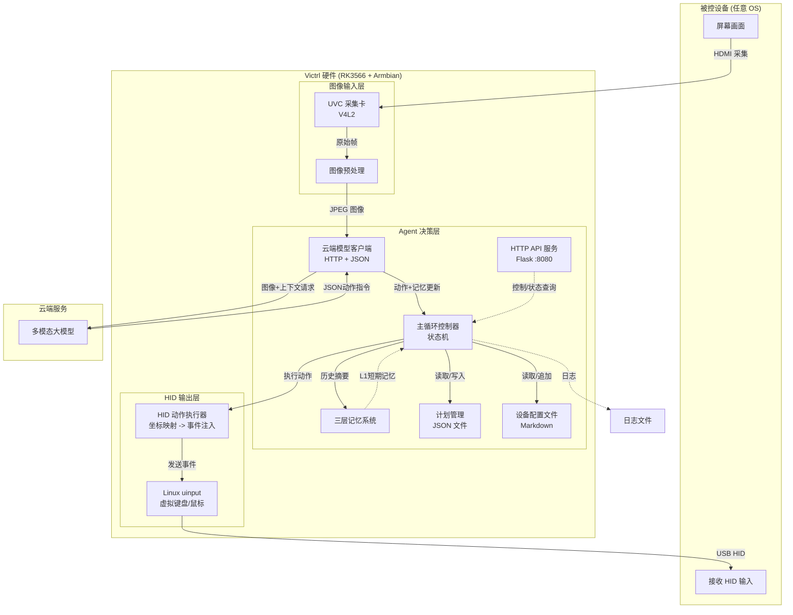

本文档旨在简介 Victrl 的软件实现路径。

## 整体架构：



数据流简述：

1. USB 采集卡捕获被控设备的 HDMI 画面
2. 将图像（可选）及当前任务上下文发送给多模态模型
3. 模型返回 JSON 指令
4. 本地 HID 执行器模拟键鼠事件
5. 循环直至任务完成或手动停止

### 图像输入层：

职责：从被控设备捕获屏幕画面，转换为适合 AI 分析的格式。

### Agent 层：

职责：核心智能体，管理记忆、调用模型、解析动作、维护任务计划。

#### 元素归一化坐标获取测试

doubao-seed-2.0-mini 是本 MVP 系统的主模型。多模态大模型本身具备精准视觉定位能力，定位坐标不准的原因通常是提问格式、坐标顺序、归一化范围和模型训练数据范式不匹配。

如 Qwen2.5-VL，它的物体检测 JSON 为：

```Plain
{"bbox_2d": [x1, y1, x2, y2], "label": "", "sub_label": ""}
```

> 参考文献：https://qwen.ai/blog?id=qwen2.5-vl

对于 doubao-seed-2.0-mini，其 Grounding 提示词为：

```Plain
Locate the "" in the image. Output strictly JSON format only, no extra explanation.
Use format: {"box_2d": [ymin, xmin, ymax, xmax], "label": ""}
All coordinates are normalized to 0-1 range and accurate to three decimal places.
```

假设原图的像素尺寸为：宽度 `W`（水平方向，对应 x 轴）、高度 `H`（垂直方向，对应 y 轴），输出的坐标是归一化到 0~1 范围的数值，每个参数的含义和转换规则为：

| 参数 | 含义（框的边界位置）                         | 对应原图像素坐标公式  | 对应图像方向                  |
| ---- | -------------------------------------------- | --------------------- | ----------------------------- |
| ymin | 框的上边界（垂直方向的最小值，最顶部的位置） | ymin_pixel = ymin × H | 垂直方向（和图像高度 H 相关） |
| xmin | 框的左边界（水平方向的最小值，最左侧的位置） | xmin_pixel = xmin × W | 水平方向（和图像宽度 W 相关） |
| ymax | 框的下边界（垂直方向的最大值，最底部的位置） | ymax_pixel = ymax × H | 垂直方向（和图像高度 H 相关） |
| xmax | 框的右边界（水平方向的最大值，最右侧的位置） | xmax_pixel = xmax × W | 水平方向（和图像宽度 W 相关） |

以下是目标检测并解析边框的一个伪代码示例：

```Python
# 1. 图片编码为 Base64
def encode_image_to_base64(image_path):
    # 读取图片二进制数据
    # 编码为 base64 字符串并返回
    pass

# 2. 调用视觉 API
def call_vision_api(api_key, image_path, prompt):
    # 图片转 base64
    # 构造请求头、请求体
    # 发送POST请求
    # 解析响应，返回识别结果
    pass

# 3. 从 API 响应解析目标边框坐标
def parse_bbox_from_response(response_text):
    # 提取响应中的 JSON 字符串
    # 解析 box_2d 归一化坐标
    # 解析成功返回坐标
    pass

def process_image(input_path, output_path, target_char, api_key):
    if response:
        # 解析边框坐标
        bbox = parse_bbox_from_response(response)
        if bbox:
            # 归一化坐标转像素坐标
            # 在原图上绘制红色目标边框
            cv2.rectangle(图片, 边框坐标, 红色, 线宽)

    # 保存最终处理后的图片
    cv2.imwrite(output_path, img)
```

处理后的图片示例：


> 用户提示词：“我要 Star 这个项目，该点哪里？”


> 用户提示词：如果我想寻找摄影作品该点击哪里

#### 主进程

Victrl MVP 完全依赖单个多模态模型来完成从任务识别、规划到逐步执行的所有决策。主进程仅负责按模型要求采集图像 →  调用模型 → 解析 JSON → 执行动作 → 重复。模型自主决定每一步是否需要看屏幕与该步骤的 `action`，并且维护一个可更新的 `yyyyMMddHHmmss-plan` 来跟踪进度。

循环不使用固定的时间间隔，而是要么连续紧接循环，要么模型自主输出等待时长。

以下是主进程的一个伪代码示例：

```Python
def run():
    plan = None
    history = []
    need_screen = True   # 首次必须看屏幕
    
    while True:
        # 1. 根据 need_screen 决定是否采集
        image_b64 = capture_and_encode() if need_screen else None
        
        # 2. 调用模型
        response = call_model(image=image_b64, plan=plan, history=history[-5:])
        
        # 3. 执行动作
        if response.action_type == "click":
            x,y = bbox_to_center(response.box_2d, screen_width, screen_height)
            mouse_click(x,y)
        elif response.action_type == "type":
            keyboard_type(response.text)
        elif response.action_type == "wait":
            time.sleep(response.wait_seconds)
        elif response.action_type == "complete" or response.done:
            print("任务完成")
            break
        elif response.action_type == "error":
            print("错误:", response.message)
            break
        
        # 4. 记录历史
        history.append({"action": response.action_type, "result": "success"})
        
        # 5. 更新 plan
        plan = response.plan_update
        
        # 6. 处理 profile_updates    
        self._append_to_profile(upd.get("content", ""))
            
        # 7. 设置下一轮是否需要屏幕
        need_screen = response.need_screen
        
        # 8. 可选的节流
        time.sleep(0.5)   # 给界面稳定时间
```

模型输出的 JSON 动作集（部分）：

| action_type | 说明                       | 示例字段                        |
| ----------- | -------------------------- | ------------------------------- |
| `click`     | 鼠标左键点击归一化坐标区域 | `box_2d: [ymin,xmin,ymax,xmax]` |
| `move`      | 移动鼠标到指定区域         | `box_2d`                        |
| `type`      | 输入字符串                 | `text: "Hello"`                 |
| `press`     | 按下组合键                 | `keys: ["ctrl","c"]`            |
| `scroll`    | 滚动                       | `delta_x, delta_y`              |
| `wait`      | 等待若干秒                 | `seconds: 1.5`                  |
| `complete`  | 任务成功结束               | -                               |
| `error`     | 任务失败并给出原因         | `message`                       |

模型还可通过 `need_screen` 控制下一轮是否需要图像，通过 `sleep_before_next` 控制动作执行后的等待时间，实现高效、自适应的循环。

### HID 输出层：

职责：将 Agent 决策的抽象动作转换为真实的键盘/鼠标事件，注入到被控电脑。

对于 99% 的桌面 GUI 自动化任务，HID 模拟完全可以覆盖。 但确实存在少数边缘情况需要特殊设计。

执行流程：

1. Agent 输出 `click` 动作，附带归一化坐标 `[ymin, xmin, ymax, xmax]`
2. HID 层将坐标映射为屏幕像素（`x = (xmin+xmax)/2 * screen_width`）
3. 移动鼠标到目标点，发送 `BTN_LEFT` 按下/释放事件
4. 返回执行结果