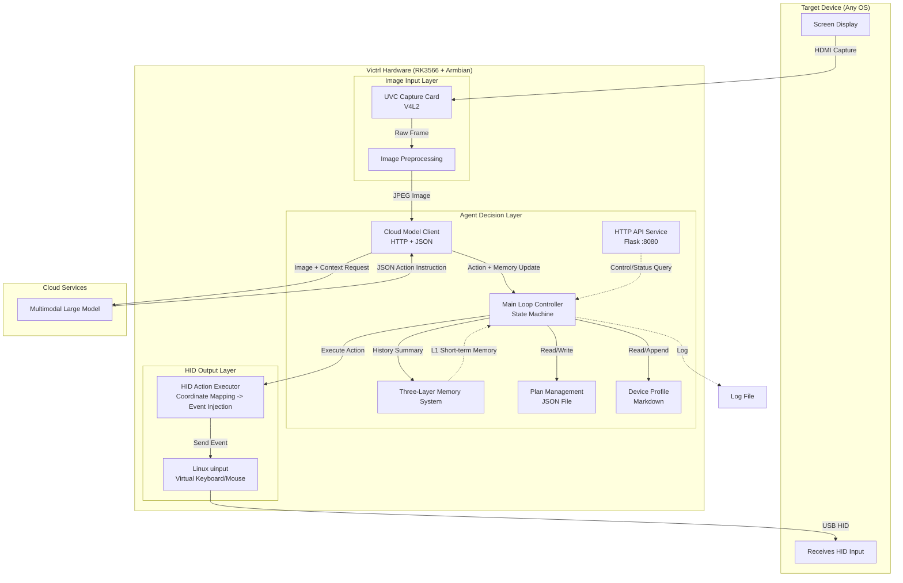

# Victrl

## Bringing automation back to the most primitive way: See, Click, See

> [[中文](README_CN.md)|English]


Today's AI Agents rely on software-level configuration on the target device to control it. Victrl aims to build *a single hardware-only AI Agent device independent of the controlled system*, achieving plug-and-play automation for any device through a human-like "UVC visual input + HID output" approach.

Victrl does not rely on OS APIs, Accessibility, ADB, VNC, RDP… Instead, it fully simulates the "human using a computer" process:

```
Analyze screen → Operate keyboard/mouse → Observe results
```

The entire project is essentially exploring a new architecture: **Hardware AI Agent**.

Victrl makes it possible for AI Agents to perform special operations such as tweaking BIOS settings or fully automated OS installation.

This repository is the Victrl MVP version, open-sourced under the Apache 2.0 license. The full commercial version will be provided as closed source.

------

## Value & Features:

- **Pure hardware implementation**: MVP uses a Linux development board + capture card + HID emulation, completely independent of the target device
- **Plug and play**: Captures screen, emulates keyboard/mouse — no software pre-installation required on any OS (Windows/Linux/macOS/Android)
- **Cross-platform versatility**: Theoretically compatible with any device that has video output + HID input (PCs, phones, industrial PCs, embedded terminals, etc.)
- **Zero intrusion**: No modifications to the target system, no software installed, no log traces left behind
- **LLM-driven decisions**: Calls any multimodal large model (GPT, Claude, Gemini, Doubao-seed, etc.) to understand the screen and generate operation instructions
- **Offline capable**: Currently relies on cloud models, but the architecture allows local small-model deployment for full localization
- **Lightweight control**: Only requires V4L2 + uinput, core loop implemented in Python with extremely low resource usage, potentially fully portable to an MCU
- **Memory system**: L1, L2, L3 — allows the model to autonomously append experience
- **HTTP API**: Provides interfaces for task start/stop, status query, configuration management, etc.
- **Extensible architecture**: Reserved extension points such as a skill system, on-demand loading, and exploration mode
- **Universal target scenarios**: Covers personal productivity, enterprise legacy systems, automated testing, operations, and more
- **Hardware miniaturization**: Can be built as a "USB-sized" portable device — plug and play for automation

Victrl uses a **single** hardware device — **pure hardware, pure peripheral** — completely independent of the target device's software ecosystem. This "human-like operation" approach:

> **Makes almost any device — no matter how old, closed, or unfriendly — a target for automated control.**

------

## Overall Architecture:



Data flow summary:
1. Capture the target device's HDMI output via a USB capture card
2. Send the image (optional) along with the current task context to the multimodal model
3. The model returns a JSON instruction
4. The local HID executor simulates keyboard/mouse events
5. Loop until the task is completed or manually stopped

> More: See the [Technical Document](Docs/Technical%20Document.md)

------

## Quick Start:

### Hardware Preparation
- RK3566 development board (with Armbian / Ubuntu 22.04+ installed) or any Linux host
- USB capture card
- HDMI cable, USB A-to-A cable

> Reference: [ZERO Series | Radxa Docs](https://docs.radxa.com/zero)

### Software Installation

```bash
To be updated
```

#### Configuration:

Edit `device_profile.md` (describe the target device's characteristics, common shortcuts, etc. in natural language). A template will be automatically generated on first run.

### Run the Agent

```bash
To be updated
```

### HTTP API Example

```bash
To be updated
```

------

## Extensibility Notes:

The following capabilities are only reserved in the architecture for this version and will be fully implemented in the commercial version:
- **Skill System**: Invoke predefined YAML macros via the `call_skill` action
- **On-Demand Configuration Loading**: The model can request loading only specific sections of the device profile
- **Exploration Mode**: The model actively scans the screen, discovers elements, and records them into memory
- **Categorized Long-Term Memory**: Splitting a single document into multiple sub-documents indexed by category
- **Visual Interface**: The device will integrate a small LCD screen and function buttons for better interaction

------

## Caution:

Victrl transforms "visual automation" from a software solution into a hardware peripheral, thereby bypassing any software restrictions on the target device (such as firewalls, permission policies, system integrity protection). It is recognized by the target device as a standard keyboard/mouse. This means it can perform any keyboard/mouse operation, including but not limited to: launching commands, deleting files, modifying system settings, downloading malware.

Victrl itself contains no malicious logic and does not attempt to bypass any security mechanisms. However, once connected to an untrusted host controller or if the configuration file is maliciously tampered with, serious consequences may result. Users must:

- Thoroughly test
- Physically protect the Victrl device from unauthorized access
- Only obtain task configurations and skill pack updates from trusted sources
- Assess whether the task could cause data loss or system damage before running Victrl on the target device

## License & Disclaimer:

Victrl MVP is open-sourced under the **Apache 2.0 License**. This project is intended for research and automation learning purposes only. Users must bear the risk that automated operations may violate the software license agreements of target devices. The author and contributors are not liable for any direct, indirect, incidental, special, or punitive damages, including but not limited to data loss, system damage, business interruption, or violation of third-party terms of service.

------

> *It doesn't read your memory, it doesn't occupy your device — it just quietly watches the screen, then presses the keyboard for you, just like a human would.*