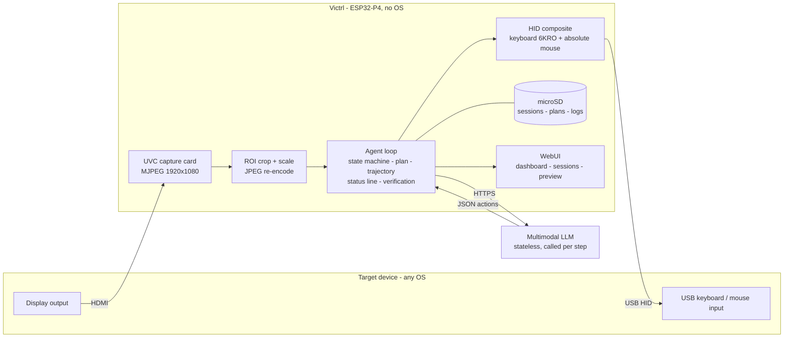
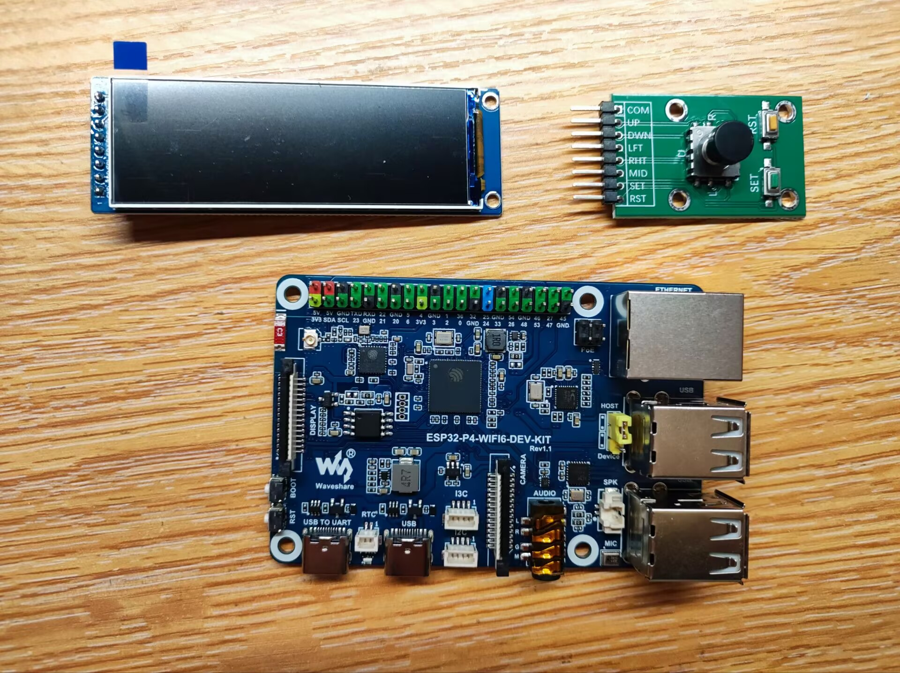
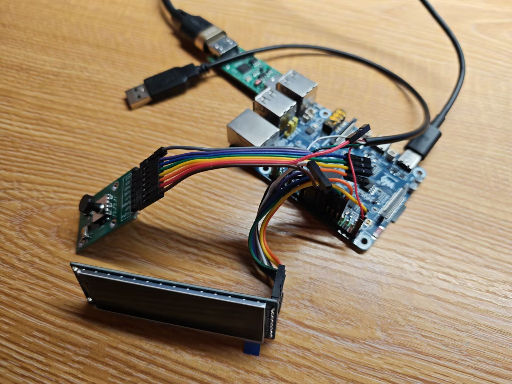

# Victrl

## Bringing automation back to the most primitive way: **see, click, see**

> **English** | [中文](README_CN.md)

 -brightgreen)  

Today's AI agents depend on software-level access to the target device — an API, an accessibility layer, ADB, VNC, RDP, a driver, an agent process running inside it. **Victrl takes the opposite route: a single hardware device that is independent of the system it controls**, working the way a person does — look at the screen, press the keys.

```
capture the display  →  press keyboard/mouse  →  observe the result
```

Nothing is installed on, injected into, or read out of the target. It attaches as an ordinary external display sink plus a standard USB keyboard and mouse, so it works on anything with a video output and a USB port: **Windows, Linux, macOS, Android, industrial PCs, embedded terminals — and old, closed or unfriendly machines that no software agent can reach.** That includes things no API-based agent can do at all, such as changing BIOS settings or performing an unattended OS install.

The whole project is an exploration of one architecture: the **Hardware AI Agent**.

> **This repository is the current implementation: the agent loop runs on the MCU.**

Earlier, the same loop was validated as a Python system on Linux, driving a capture card and a serial HID bridge. That prototype proved the concept and is documented in [`docs/Prototype.md`](docs/Prototype.md) — it is **not** the code in this repository. What is here is the version where the entire agent harness was compressed onto a microcontroller with no operating system.

---

## What "the agent loop runs on the MCU" means, precisely

The LLM is a stateless function called over HTTPS. Everything that turns a stateless model into an agent lives **on the device**:

- the sense → think → act state machine
- the trajectory (its memory), the plan, and the conversation-window store
- the status line: cursor position, held buttons, lock-key state, whether the screen changed
- verification and **failure classification**
- the MJPEG decode, region-of-interest crop/scale, re-encode and upload pipeline
- the HID synthesis, and the on-device WebUI

There is no Linux, no Python and no OS on the board — ESP-IDF 6.0.1 with FreeRTOS, 32 MB of PSRAM and a microSD card. The cloud does inference and nothing else, for this project and for software agents alike; what differs is where the *rest* runs. A software agent's harness and memory need a general-purpose OS plus a software path to the target — the target itself, or a machine that reaches it over the network, an API or a remote-desktop protocol. Here both live on a microcontroller outside the target: the trajectory, plan and session store never touch the target's disk. What the target *can* see is the device itself — it enumerates as a USB HID device named **Victrl HID Bridge** by **Victrl**, carrying a per-device serial derived from the chip's MAC. Being identifiable is deliberate: a peripheral that could not be attributed would be a concealment tool, and this is not one.

## Value & characteristics

- **Pure hardware.** Independent of the target's software ecosystem. It has no idea what an API is.
- **Plug and play.** Any device with a video output and a USB port — no pre-installation, no agent, no hook, no driver, nothing to configure on the target.
- **Non-intrusive by construction.** It cannot read the target's files, memory or disk. It sees only what the display shows.
- **Runs as the logged-in user.** The target's permission model, account privileges and login state all still apply. Victrl cannot obtain any privilege the person at the keyboard does not already have.
- **Self-contained.** One board, one capture card, one SD card. It is a peripheral you plug in.
- **Measured, not claimed.** Every number below comes from a real run, and the failures are published alongside the successes — see [The hard part](#the-hard-part).

---

## Where a software agent cannot go

Software computer use has two preconditions: a running OS on the target, and a way in — a network path, an agent process, an API, an accessibility layer. Victrl needs neither, and that is not a difference of degree: there are tasks where a software agent cannot compete at all, however capable the model behind it becomes.

**Before the target has a usable OS.** BIOS/UEFI setup, the boot menu, a disk-encryption prompt, an OS installer, a recovery console — in those phases there is no runtime for software to live in. Changing Secure Boot or the boot order, configuring RAID, flashing firmware, installing an OS on a machine that cannot network-boot, recovering a machine whose boot configuration is broken: the alternatives are network boot with prepared images, a BMC, or a person sitting in front of it. Victrl needs a video output and a USB port, and it *watches* what it did — whether a menu was driven correctly is confirmed on the screen, not inferred from an exit code.

**Targets that cannot take software.** Legacy SCADA HMIs, industrial and laboratory instruments, CNC machines, POS terminals, vendor-locked appliances: no API, nothing that can host an agent, and often no vendor support left. The same holds wherever installing anything is forbidden — regulated environments, third-party sites, machines you may plug into but not modify. One device covers a room of heterogeneous machines that would otherwise each need their own software integration.

**When the target's own network is the fault.** A software agent runs *on* the target, so it reaches the model through the target's network — and when the fault *is* that network, the agent goes offline at exactly the moment it is needed. That deadlock cannot happen here: the model connection lives on the device, so it can repair the target's network from outside while the target has none at all. For an individual this is where the project earns its place, because the enterprise answers to "the machine will not boot" are a BMC on server-class hardware or a paid remote-hands service, while this is one board that works on a laptop too.

That decoupling is not a licence to automate everything that happens to be offline. An isolated or encrypted environment is usually isolated on purpose, and pointing this device at one is hasty — it deserves more caution than an ordinary target, not less.

The other side is set out in full under [What this does **not** do](#what-this-does-not-do): wherever the target can run software, or the work lives in the cloud, a software agent is faster, cheaper and more capable, and this device is the wrong tool.

---

## Architecture


```mermaid
graph LR
    subgraph Target["Target device - any OS"]
        Screen[Display output]
        HIDin[USB keyboard / mouse input]
    end

    subgraph Victrl["Victrl - ESP32-P4, no OS"]
        UVC["UVC capture card<br/>MJPEG 1920x1080"]
        Prep["ROI crop + scale<br/>JPEG re-encode"]
        Loop["Agent loop<br/>state machine - plan - trajectory<br/>status line - verification"]
        HIDout["HID composite<br/>keyboard 6KRO + absolute mouse"]
        SD[("microSD<br/>sessions - plans - logs")]
        Web["WebUI<br/>dashboard - sessions - preview"]
    end

    Cloud["Multimodal LLM<br/>stateless, called per step"]

    Screen -->|HDMI| UVC
    UVC --> Prep
    Prep --> Loop
    Loop --> HIDout
    HIDout -->|USB HID| HIDin
    Loop --- SD
    Loop --> Web
    Loop -->|HTTPS| Cloud
    Cloud -->|JSON actions| Loop
```

Each step: capture a frame, optionally crop/scale it to a region of interest, encode and upload it together with a text status line and the trajectory, receive JSON actions, execute them over HID, observe the result. The loop is stateless toward the API and stateful on the SD card.

---

## Measured

| | Measured on real hardware |
|---|---|
| Wall clock per step | **3.8 – 6.8 s** |
| API share of that | **64 – 91 %** |
| Throughput | ~116 output tokens/s ⇒ **a step's wall clock ≈ its output tokens ÷ 116** |
| Request body, full frame | **406 KB** |
| Request body, zoomed into a region | **87 – 89 KB** (4.7×) |
| Full-resolution decode buffer | 6.2 MB, **cached across steps** |
| Trajectory store | text only, zero historical screenshots |

These numbers come from the ESP32-P4 build talking to **DeepSeek V4.1 flash** (`model_name: "deepseek-flash"`) — a fast, natively multimodal model. Both properties are load-bearing here: the API dominates every step, so step latency is essentially output tokens divided by model throughput, and native vision is what lets the device upload a screen rather than a description of one.

Two conclusions fell out of the numbers that were not obvious:

**Output tokens dominate latency, not capture or codecs.** Giving the model explicit per-field text budgets cut output by **43–58 %** and API time by **15–25 %**. No image-pipeline optimisation came close.

**Ambiguity is a latency bug.** An ambiguously worded multi-step instruction drove reasoning from ~60 to **2326 tokens** and one step to **13.6 s**, which no effort setting contained. Writing the instruction clearly was worth more than any tuning.

---

## The hard part

Driving a GUI with a language model is not the interesting problem. The interesting problem is that the device's output channel is **character-level**, and the target is free to **reinterpret those characters**. Most of this project's engineering effort went there, and the results are the most transferable thing in it.

**A Chinese IME silently eats digits.** Typing `Vicrl-7391-A` into Notepad produced `Vicrl--A`: the device had queued `ALL 12/12` key events and the application's own status bar reported 8 characters. Letters, hyphens, spaces and punctuation all survive — **digits alone are consumed**, on the main number row *and* on the numeric keypad (measured with Num Lock confirmed on).

**A blind toggle is worse than no toggle.** `shift` and `ctrl+space` flip the *same* state. A model told to try one and then the other toggles twice and lands exactly where it started — which is how one dropped digit became an escalating recovery loop. The mode is a **parity the device cannot observe**.

**The fix is a probe — and its timing matters as much as the probe.** Type the 2-character probe `a1` and read the application's own character count: `a1` means the mode is right, `a` alone means it is not. That converts an unobservable parity into a measurable state. But three toggles in a row, each probed in the *same* batch, all looked like failures — and the next multi-word type with no toggle at all came through intact. **The toggles had worked all along**; the probe was sent before the asynchronous mode switch landed. A false negative here is more expensive than no probe at all.

**Two identical symptoms, opposite fixes** — the classification the harness now does for itself, and the single most expensive mistake we made:

| Discriminator | Cause | Fix |
|---|---|---|
| `queued < len` | the device never sent it | transport / HID problem |
| screen **unchanged** after the action | the keystrokes never reached the field — **focus** | click into the field, then retype |
| screen **changed** but the text is wrong | the characters were **reinterpreted** on the target | change the input *channel*, not the retry count |

Full write-ups, with the logs, are in [`docs/Failure-Taxonomy.md`](docs/Failure-Taxonomy.md) and [`docs/Input-Method-Troubles.md`](docs/Input-Method-Troubles.md).

---

## Hardware



*Three parts. Top left: the NV3007 142×428 SPI display. Top right: the button board — start, pause and abort without touching a browser. Bottom: the Waveshare ESP32-P4-WIFI6-DEV-KIT.*



*Assembled. The capture card sits on the P4's USB host port and sees the target's HDMI output; the P4 presents itself as an ordinary keyboard and mouse on the other side.*

| Part | Role |
|---|---|
| **ESP32-P4** — dual-core RISC-V, 32 MB PSRAM, 16 MB flash | the entire agent |
| **ESP32-C6** over SDIO (ESP-Hosted) | WiFi |
| **MS2109** USB capture card | MJPEG 1920×1080 — the agent's eyes |
| **TinyUSB** composite HID | keyboard (6KRO, 1 ms interval) + absolute mouse (0…32767) |
| **NV3007** 142×428 SPI LCD | on-device status |
| Button board (GPIO0 / GPIO1) | start · pause · abort, without a browser |
| microSD (FAT32) | sessions, plans, trajectories, task logs |

---

## Quick start

```bash
cp sdcard/config.example.json sdcard/config.json   # add your API key and WiFi credentials
# copy sdcard/ to a FAT32 microSD card
# build with ESP-IDF 6.0.1 and flash
```

`config.json` is git-ignored — it holds live credentials. The template is [`sdcard/config.example.json`](sdcard/config.example.json).

The device brings up its own WebUI: dashboard, conversation windows, live screen preview, SD file browser, and a per-step latency breakdown (`total / capture / prep(setup,dec,rs,enc) / connect / http / parse / sdlog / exec / sleep`). That breakdown is the first thing to look at when a step is slow, and it is how every number in this README was measured.

Full technical documentation: [`docs/技术文档.md`](docs/技术文档.md) (Chinese, and considerably more detailed than this page).

---

## What this does **not** do

- **It is not a software agent.** It cannot run inside the target, read its files, or call its APIs. If you can install software on the target, use a software tool — it will be faster and more capable.
- **It needs a video output it can capture.** Machines with no display output, DRM-protected video, or output that never reaches the capture card are out of reach. A camera-based variant that *recognises* a screen instead of capturing it would drop even that requirement; it is a direction, not something implemented here.
- **It needs the target to accept a USB keyboard.** Bluetooth HID is a natural extension; USB is what is implemented today.
- **It runs as the logged-in user, and nothing more.** An unattended machine sitting at a lock screen is not something Victrl can get past — by design, it has no bypass capability.
- **Chinese IMEs are a real limitation.** In Chinese mode, digits typed into GUI text fields are consumed. There are workarounds; a task that genuinely requires typing digits into a text field on such a machine is blocked.
- **Latency is the model's**, and it needs network plus an API key.
- No audio, no file transfer, no clipboard integration beyond keystrokes.

---

## Caution

Victrl turns "visual automation" from a software approach into a hardware peripheral. It attaches to the target as an ordinary external display sink plus a standard USB keyboard and mouse. It contains no exploit, no vulnerability, no credential or signature bypass, and no logic aimed at defeating security controls: it neither breaks into a system nor reads its stored data, and it sees the target only through its display output. It also does not hide itself — it announces a manufacturer, a product name and a per-device serial to the host, so the target can always tell that it is attached, and which unit it is.

Because the target treats it as a normal keyboard and mouse, it can perform **any keyboard/mouse operation** the logged-in user could perform — including **running commands, deleting files, modifying system settings, and downloading software**. The target's own permission model and login state still apply: Victrl operates *as* whoever is logged in, and never as a higher-privileged identity.

Two hard limits follow, and they are the user's responsibility, not the project's:

- **Authorized targets only.** Connect Victrl only to devices you own or are expressly authorized in writing to operate. Connecting it to someone else's device without authorization — or continuing to control a device after authorization is withdrawn — may constitute illegal intrusion into, or illegal control of, a computer information system.
- **Physically protect the device.** Anyone who can reach an already-configured Victrl can operate the target through it. Keep it under physical control, and load task configurations only from trusted sources.

### Usage principles (binding)

1. **Authorized use only.** Permitted: (a) devices you own or lawfully possess; (b) enterprise automation, testing, operations, accessibility, or legacy-system scenarios where the device's owner or administrator has given **prior, documented authorization**. Prohibited: any **unauthorized** access to or control of another person's computer information system, obtaining its data, or attaching the device to a third party's equipment without authorization.
2. **No concealment.** Do not use Victrl to hide its presence or activity on a target, or to defeat the target's security controls.
3. **No unlawful ends.** Do not use Victrl to obtain others' credentials, authentication codes, or personal information, to commit fraud, or to deploy malware.
4. **You are the responsible party.** The operator is solely responsible for ensuring the use complies with applicable law (in mainland China, notably Articles 285 and 286 of the Criminal Law and Article 27 of the Cybersecurity Law) and with the target device's licence terms and internal policies.

The project itself contains no malicious logic and is published for research and lawful automation. The maintainers neither provide nor endorse any unauthorized-control use case.

**Read the [Authorization & Compliance Notes](docs/Compliance.md) before connecting anything.** It sets out the legal framework, the offence thresholds, a scenario-by-scenario risk matrix, and the engineering practices that keep a project like this on the right side of the line.

---

## Documentation

| | |
|---|---|
| [`docs/Technical-Document.md`](docs/Technical-Document.md) | Full technical documentation — architecture, every component, the complete decision record |
| [`docs/Failure-Taxonomy.md`](docs/Failure-Taxonomy.md) | How the harness tells "never arrived" from "was reinterpreted" — *the hard part*, in full |
| [`docs/Input-Method-Troubles.md`](docs/Input-Method-Troubles.md) | The input-method bug, start to finish, including what is still unsolved |
| [`docs/Prototype.md`](docs/Prototype.md) · [`docs/MCU-Port.md`](docs/MCU-Port.md) | The Linux/Python prototype, and what moving the harness onto the chip actually cost |
| [`docs/Compliance.md`](docs/Compliance.md) | Authorization & compliance notes |

Every document is available in Chinese as well: [`技术文档`](docs/技术文档.md) · [`失败分类学`](docs/失败分类学.md) · [`输入法问题`](docs/输入法问题.md) · [`原型`](docs/原型.md) · [`MCU移植`](docs/MCU移植.md) · [`合规与授权说明`](docs/合规与授权说明.md)

Every component under [`components/`](components/) also carries its own README — `components/<name>/README.md` and `README_CN.md` — documenting its public API, its Kconfig options and the parts of its source that are easiest to misread.

Recent changes are recorded in [`CHANGELOG.md`](CHANGELOG.md) ([中文](CHANGELOG_CN.md)).

## License & disclaimer

Victrl is open-sourced under the **Apache 2.0 License**. It is intended for research, automation and **lawfully authorized** operations only. Users must bear the risk that automated operations may violate the licence agreements of target devices. Using Victrl for cracking, intrusion, or unauthorized control of computer information systems is prohibited. The Apache 2.0 licence grants copyright permissions only — **it does not, and cannot, exempt anyone from criminal or administrative liability.**

The author and contributors are not liable for any direct, indirect, incidental, special, or punitive damages, including but not limited to data loss, system damage, business interruption, or violation of third-party terms of service, arising from use of this software.

------

> *It doesn't read your memory, it doesn't occupy your device — it just quietly watches the screen, then presses the keyboard for you, just like a human would.*
