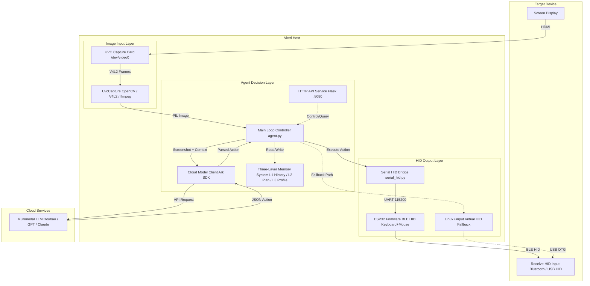

# Victrl

## Bringing automation back to the most primitive way: See, Click, See

> [[中文](README_CN.md)|English]

   

Today's AI Agents rely on software-level configuration on the target device to control it. Victrl aims to build *a single hardware-only AI Agent device independent of the controlled system*, achieving plug-and-play automation for any device through a human-like "UVC visual input + HID output" approach.

Victrl does not rely on OS APIs, Accessibility, ADB, VNC, RDP… Instead, it fully simulates the "human using a computer" process:

```
Analyze screen → Operate keyboard/mouse → Observe results
```

The entire project is essentially exploring a new architecture: **Hardware AI Agent**.

Victrl makes it possible for AI Agents to perform special operations such as tweaking BIOS settings or fully automated OS installation.

This repository is the **Victrl MVP** version, open-sourced under the **Apache 2.0** license. The full commercial version will be provided as closed source.

------

## Value & Features:

- **Pure hardware implementation**: MVP uses Linux + capture card + HID emulation, completely independent of the target device
- **Plug and play**: Captures screen, emulates keyboard/mouse — no software pre-installation required on any OS (Windows/Linux/macOS/Android)
- **Cross-platform versatility**: Theoretically compatible with any device that has video output + HID input (PCs, phones, industrial PCs, embedded terminals, etc.)
- **Universal target scenarios**: Covers personal productivity, enterprise legacy systems, automated testing, operations, and more
- **Non-intrusive integration**: Nothing is installed on or modified in the target system, and no target-side agent, hook, or driver is required
- **LLM-driven decisions**: Calls any multimodal large model (GPT, Claude, Gemini, Doubao-seed, etc.) to understand the screen and generate operation instructions
- **Offline capable**: Currently relies on cloud models, but the architecture allows local small-model deployment for full localization
- **Memory system**: L1, L2, L3 — allows the model to autonomously append experience
- **Extensible architecture**: Reserved extension points such as a skill system, on-demand loading, and exploration mode
- **Hardware miniaturization**: Can be built as a "USB-sized" portable device — plug and play for automation

Victrl uses a **single** hardware device — **pure hardware, pure peripheral** — completely independent of the target device's software ecosystem. This "human-like operation" approach:

> **Makes almost any device — no matter how old, closed, or unfriendly — automatable, provided you own it or have obtained prior authorization from its owner.**

Victrl grants no authorization by itself. Whether its use is lawful is determined entirely by the relationship between the operator and the target device — read the [Authorization & Compliance Notes](Docs/Compliance.md) before connecting anything.

------

## Overall Architecture:


```mermaid
graph TD
    subgraph "Target Device"
        Screen[Screen Display]
        HID_Target[Receive HID Input Bluetooth / USB HID]
    end

    subgraph "Victrl Host"
        subgraph "Image Input Layer"
            UVC[UVC Capture Card /dev/video0]
            Capture[UvcCapture OpenCV / V4L2 / ffmpeg]
        end

        subgraph "Agent Decision Layer"
            Agent[Main Loop Controller agent.py]
            CloudClient[Cloud Model Client Ark SDK]
            Memory[Three-Layer Memory System L1 History / L2 Plan / L3 Profile]
            HTTPServer[HTTP API Service Flask :8080]
        end

        subgraph "HID Output Layer"
            SerialBridge[Serial HID Bridge serial_hid.py]
            ESP32[ESP32 Firmware BLE HID Keyboard+Mouse]
            Uinput[Linux uinput Virtual HID Fallback]
        end
    end

    subgraph "Cloud Services"
        VLM[Multimodal LLM Doubao / GPT / Claude]
    end

    %% Main Data Flow
    Screen -->|HDMI| UVC
    UVC -->|V4L2 Frames| Capture
    Capture -->|PIL Image| Agent
    Agent -->|Screenshot + Context| CloudClient
    CloudClient -->|API Request| VLM
    VLM -->|JSON Action| CloudClient
    CloudClient -->|Parsed Action| Agent
    Agent -->|Read/Write| Memory
    Agent -->|Execute Action| SerialBridge
    SerialBridge -->|UART 115200| ESP32
    ESP32 -->|BLE HID| HID_Target
    Agent -.->|Fallback Path| Uinput
    Uinput -.->|USB OTG| HID_Target

    %% Auxiliary Flow
    HTTPServer -.->|Control/Query| Agent
```

Data flow summary:

1. Capture the target device's HDMI output via a USB capture card
2. Send the image (optional) along with the current task context to the multimodal model
3. The model returns a JSON instruction
4. The local HID executor simulates keyboard/mouse events
5. Loop until the task is completed or manually stopped

> More: See the [Technical Document](Docs/Technical%20Document.md)

------

## Quick Start:

See [Main](Main/README.md).

------

## Commercial Version:

The commercial version will comprehensively enhance **hardware form factor and intelligence capabilities** on top of the open-source MVP:

The hardware will be downsized to the size of a USB stick or TV dongle, integrating a small screen and buttons. An optional camera version (for devices without video output) will be available.

Supports dual control via mobile App and WebUI, voice input, skill system, exploration mode, and multimodal memory. Supports multi-device profiles and screen resolution auto-adaptation.

Interaction-wise, it implements task decomposition and confirmation, proactive inquiry, and accessibility extensions.

Efficiency aspects include context optimization and faster decision-making. Supports multi-Victrl device coordination for cross-device collaborative automation, etc.

------

## Caution:

Victrl turns "visual automation" from a software solution into a hardware peripheral. It attaches to the target device as an ordinary external display sink plus a standard Bluetooth/USB keyboard and mouse. It contains no exploit, no vulnerability, no credential or signature bypass, and no logic aimed at defeating security controls: it neither breaks into a system nor reads its stored data, and it sees the target only through its HDMI/display output.

Because the target treats it as a normal keyboard and mouse, it can perform **any keyboard/mouse operation** the logged-in user could perform — including but not limited to **running commands, deleting files, modifying system settings, and downloading software**. The target's own permission model, account privileges, and login state still apply: Victrl operates *as* whoever is logged in, and never as a higher-privileged identity.

Two hard limits follow, and they are the user's responsibility, not the project's:

- **Authorized targets only.** Connect Victrl only to devices you own or are expressly authorized in writing to operate. Connecting it to someone else's device without authorization — or continuing to control a device after authorization is withdrawn — may constitute illegal intrusion into, or illegal control of, a computer information system.
- **Physically protect the device.** Anyone who can reach an already-paired Victrl can operate the target through it. Keep it under physical control, and load task configurations and skill packs only from trusted sources.

### Usage principles (binding)

1. **Authorized use only.** Permitted: (a) devices you own or lawfully possess; (b) enterprise automation, testing, operations, accessibility, or legacy-system scenarios where the device's owner or administrator has given **prior, documented authorization**. Prohibited: any **unauthorized** access to or control of another person's computer information system, obtaining its data, or attaching the device to a third party's equipment without authorization.
2. **No concealment.** Do not use Victrl to hide its presence or activity on a target, or to defeat the target's security controls.
3. **No unlawful ends.** Do not use Victrl to obtain others' credentials, authentication codes, or personal information, to commit fraud, or to deploy malware.
4. **You are the responsible party.** The operator is solely responsible for ensuring the use complies with applicable law (in mainland China, notably Articles 285 and 286 of the Criminal Law and Article 27 of the Cybersecurity Law) and with the target device's licence terms and internal policies.

The project itself contains no malicious logic and is published for research and lawful automation. The maintainers neither provide nor endorse any unauthorized-control use case.

## License & Disclaimer:

Victrl MVP is open-sourced under the **Apache 2.0 License**. This project is intended for research, automation, and lawfully authorized operations only. Users must bear the risk that automated operations may violate the software licence agreements of target devices. It is prohibited to use Victrl for cracking, intrusion, unauthorized control of computer information systems, or any other illegal activity. The Apache 2.0 licence grants copyright permissions only — **it does not, and cannot, exempt anyone from criminal or administrative liability**.

Before deploying Victrl, read the [Authorization & Compliance Notes](Docs/Compliance.md). The author and contributors are not liable for any direct, indirect, incidental, special, or punitive damages, including but not limited to data loss, system damage, business interruption, or violation of third-party terms of service, arising from use of this software.

------

> *It doesn't read your memory, it doesn't occupy your device — it just quietly watches the screen, then presses the keyboard for you, just like a human would.*
