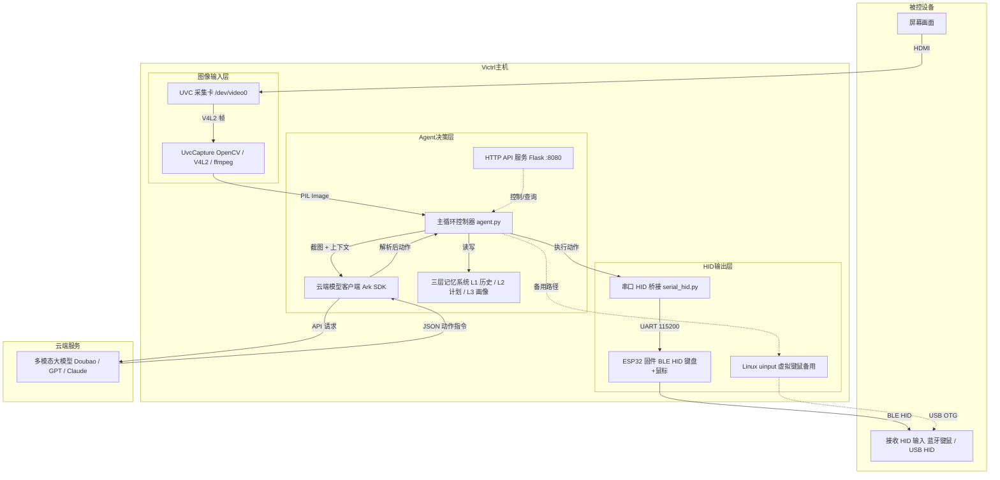

# Victrl

## 让自动化回归最原始的方式：看见，点击，看见

> [中文|[English](README.md)]

 

当今 AI Agent 依赖于在目标设备上进行软件的基础配置以操控设备，Victrl 的目标是构建*单个独立于被控系统的 AI Agent 纯硬件设备*，通过 “UVC 视觉输入 + HID 输出” 的类人方式，实现对任意设备即插即用式的自动化操作。

Victrl 不依赖 OS API、Accessibility、ADB、VNC、RDP……而是完全模拟 “人类使用电脑” 的过程：

```
解析屏幕 → 操作键鼠 → 观察结果
```

整个项目本质上是在探索一种：**Hardware AI Agent** 的新型架构。

Victrl 使得让 AI Agent 调整 BIOS、全自动安装操作系统等特殊操作成为可能。

本仓库为 Victrl MVP 版本，基于 Apache 2.0 协议开源。商业化的完整版将闭源提供。

------

## 价值特点：

- 纯硬件实现：MVP 使用 Linux 开发板 + 采集卡 + HID 模拟，完全独立于目标设备运行
- 即插即用：采集屏幕画面、模拟键鼠，对任意 OS（Windows/Linux/macOS/Android）均无需预装软件
- 跨平台通用性：理论上兼容所有带视频输出 + HID 接收的设备（PC、手机、工控机、嵌入式终端等）
- 零侵入：不修改目标系统、不安装任何软件、不留日志痕迹
- LLM 决策：调用任意多模态大模型（GPT、Claude、Gemini、Doubao-seed 等）理解屏幕并生成操作指令
- 离线可用：当前依赖云端模型，但架构允许本地小模型部署，实现完全本地化
- 轻量控制：仅需 V4L2 + uinput，Python 实现核心循环，资源占用极低，有望完全移植至 MCU
- 记忆系统：L1、L2、L3，允许模型自主追加经验
- HTTP API：提供任务启停、状态查询、配置管理等接口
- 可扩展架构：预留技能系统、按需加载、探索模式等扩展点
- 普适目标场景：覆盖个人效率、企业遗留系统、自动化测试、运维等多方面
- 硬件轻量化：能做成 “U 盘大小” 的随身设备，即插即用完成自动化操作

Victrl 采用**单个**硬件设备**纯硬件、纯外设**的方式，完全不依赖目标设备的软件生态。这种 “类人操作” 的思路：

> **让几乎任何设备——无论多老、多封闭、多不友好——都能成为被自动化操控的对象。**

------

## 整体架构：



数据流简述：

1. USB 采集卡捕获被控设备的 HDMI 画面
2. 将图像（可选）及当前任务上下文发送给多模态模型
3. 模型返回 JSON 指令
4. 本地 HID 执行器模拟键鼠事件
5. 循环直至任务完成或手动停止

> 更多：详见[技术文档](Docs/技术文档.md)

------

## 快速开始：

详见 [Main](Main/README_CN.md)。

------

## 扩展性说明：

以下能力当前版本仅预留架构位置，将于商业版完整实现：
- 技能系统：通过 `call_skill` 动作调用预定义的 YAML 宏
- 按需配置加载：模型可请求只加载设备配置文件的特定分类
- 探索模式：模型主动扫描屏幕，发现元素并记录到记忆
- 目录化长期记忆：将单一文档拆分为多个子文档，按类别索引
- 可视化界面：设备将集成小型 LCD 屏幕与功能按键以提供更好的交互
- WebUI 交互：支持通过 WebUI 控制 Victrl
- 效率优化：更少的上下文消耗和更快决策速度
- 摄像头：基于摄像头的屏幕捕获，针对无视频输出设备

------

## 注意：

Victrl 将 “视觉自动化” 从软件方案变成了硬件外设，从而避开了目标设备的任何软件限制（如防火墙、权限策略、系统完整性保护）。其在被控设备上被视为标准键盘/鼠标。这意味着它可以执行任何键鼠操作，包括但不限于：启动命令、删除文件、修改系统设置、下载恶意软件。

此类硬件级外挂对当下几乎所有潜在被控对象的安全性提出了挑战。Victrl 本身不包含任何恶意逻辑，也不会尝试绕过任何安全机制，但一旦接入不受信任的主控端或配置文件被恶意篡改，可能导致严重后果。使用者必须：

- 充分测试
- 物理保护 Victrl 设备不被未授权人员接触
- 仅从可信来源获取任务配置、技能包更新
- 在被控设备上运行 Victrl 前，评估任务是否可能造成数据丢失或系统损坏

## 许可证与免责声明：

Victrl MVP 使用 **Apache 2.0 License** 开源。本项目仅供研究和自动化学习使用。使用者必须自行承担因自动化操作可能违反目标设备软件许可协议的风险。作者及贡献者不对任何直接、间接、偶然、特殊或惩罚性损害承担责任，包括但不限于数据丢失、系统损坏、业务中断或违反第三方服务条款。

------

> *它不读取你的内存，不占据你的设备——它只是安静地看着屏幕，然后像人一样替你按下键盘。*