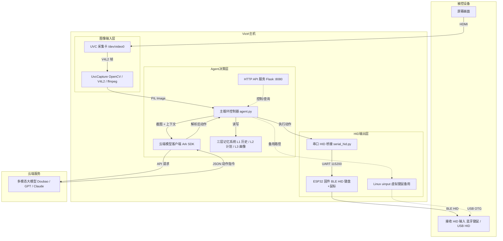

# Victrl

## 让自动化回归最原始的方式：看见，点击，看见

> [中文|[English](README.md)]

   

当今 AI Agent 依赖于在目标设备上进行软件的基础配置以操控设备，Victrl 的目标是构建*单个独立于被控系统的 AI Agent 纯硬件设备*，通过 “UVC 视觉输入 + HID 输出” 的类人方式，实现对任意设备即插即用式的自动化操作。

Victrl 不依赖 OS API、Accessibility、ADB、VNC、RDP……而是完全模拟 “人类使用电脑” 的过程：

```
解析屏幕 → 操作键鼠 → 观察结果
```

整个项目本质上是在探索一种：**Hardware AI Agent** 的新型架构。

Victrl 使得让 AI Agent 调整 BIOS、全自动安装操作系统等特殊操作成为可能。

本仓库为 **Victrl MVP** 版本，基于 **Apache 2.0** 协议开源。商业化的完整版将闭源提供。

------

## 价值特点：

- **纯硬件实现**：MVP 使用 Linux + 采集卡 + HID 模拟，完全独立于目标设备运行
- **即插即用**：采集屏幕画面、模拟键鼠，对任意 OS（Windows/Linux/macOS/Android）均无需预装软件
- **跨平台通用性**：理论上兼容所有带视频输出 + HID 接收的设备（PC、手机、工控机、嵌入式终端等）
- **普适目标场景**：覆盖个人效率、企业遗留系统、自动化测试、运维等多方面
- **无侵入式集成**：不在目标系统上安装或修改任何东西，也不需要在目标侧部署任何 Agent、钩子或驱动
- **LLM 决策**：调用任意多模态大模型（GPT、Claude、Gemini、Doubao-seed 等）理解屏幕并生成操作指令
- **离线可用**：当前依赖云端模型，但架构允许本地小模型部署，实现完全本地化
- **记忆系统**：L1、L2、L3，允许模型自主追加经验
- **可扩展架构**：预留技能系统、按需加载、探索模式等扩展点
- **硬件轻量化**：能做成 “U 盘大小” 的随身设备，即插即用完成自动化操作

Victrl 采用**单个**硬件设备**纯硬件、纯外设**的方式，完全不依赖目标设备的软件生态。这种 “类人操作” 的思路：

> **让几乎任何设备——无论多老、多封闭、多不友好——都能被自动化操作，前提是你拥有它，或已获得其所有权人的事前授权。**

Victrl 本身不授予任何授权。使用行为是否合法，完全取决于操作者与被控设备之间的关系——连接任何设备之前，请先阅读[《合规与授权说明》](Docs/合规与授权说明.md)。

------

## 整体架构：


```mermaid
graph TD
    subgraph 被控设备
        Screen[屏幕画面]
        HID_Target[接收 HID 输入 蓝牙键鼠 / USB HID]
    end

    subgraph Victrl主机
        subgraph 图像输入层
            UVC[UVC 采集卡 /dev/video0]
            Capture[UvcCapture OpenCV / V4L2 / ffmpeg]
        end

        subgraph Agent决策层
            Agent[主循环控制器 agent.py]
            CloudClient[云端模型客户端 Ark SDK]
            Memory[三层记忆系统 L1 历史 / L2 计划 / L3 画像]
            HTTPServer[HTTP API 服务 Flask :8080]
        end

        subgraph HID输出层
            SerialBridge[串口 HID 桥接 serial_hid.py]
            ESP32[ESP32 固件 BLE HID 键盘+鼠标]
            Uinput[Linux uinput 虚拟键鼠备用]
        end
    end

    subgraph 云端服务
        VLM[多模态大模型 Doubao / GPT / Claude]
    end

    %% 主数据流
    Screen -->|HDMI| UVC
    UVC -->|V4L2 帧| Capture
    Capture -->|PIL Image| Agent
    Agent -->|截图 + 上下文| CloudClient
    CloudClient -->|API 请求| VLM
    VLM -->|JSON 动作指令| CloudClient
    CloudClient -->|解析后动作| Agent
    Agent -->|读写| Memory
    Agent -->|执行动作| SerialBridge
    SerialBridge -->|UART 115200| ESP32
    ESP32 -->|BLE HID| HID_Target
    Agent -.->|备用路径| Uinput
    Uinput -.->|USB OTG| HID_Target

    %% 辅助流
    HTTPServer -.->|控制/查询| Agent
```

数据流简述：

1. USB 采集卡捕获被控设备的 HDMI 画面
2. 将图像（可选）及当前任务上下文发送给多模态模型
3. 模型返回 JSON 指令
4. 本地 HID 执行器模拟键鼠事件
5. 循环直至任务完成或手动停止

> 更多：详见[技术文档](Docs/技术文档.md)

------

## 快速开始：

详见 [Main](Main/README_CN.md)。

------

## 商业版实现：

商业版将在开源 MVP 的基础上全面增强**硬件形态与智能能力**：

硬件将缩小为 U 盘或电视棒大小，集成小型屏幕、按键。可选摄像头版本（用于无视频输出的设备）。

支持手机 App 与 WebUI 双端控制、语音输入、技能系统、探索模式、多模态记忆。支持多设备配置文件及屏幕分辨率自适应。

交互上实现任务分解与确认、主动询问及无障碍扩展。

效率层面优化上下文、加快决策速度。支持多 Victrl 设备联动，完成跨设备协同自动化等。

------

## 注意：

Victrl 将 “视觉自动化” 从软件方案变成了硬件外设：它以普通的显示输出接收端 + 标准蓝牙/USB 键鼠的形式接入被控设备。项目不包含任何漏洞利用、口令或签名绕过，也没有以规避安全机制为目的的逻辑——它既不“侵入”系统，也不读取系统内存储的数据，只能通过 HDMI/显示输出“看见”目标。

由于被控设备会把它当作普通键鼠，它可以执行**任何当前登录用户可以执行的键鼠操作**，包括但不限于：**启动命令、删除文件、修改系统设置、下载软件**。同时，被控设备自身的权限模型、账号权限与登录状态依然生效：Victrl 是以**当前已登录账号**的身份在操作，而不是更高权限的身份。

由此有两条不可逾越的边界，属于使用者的责任，而非项目的责任：

- **只连接已获授权的目标。** 只在你拥有、或已被明确书面授权操作的设备上使用 Victrl。未经授权接入他人设备，或在授权被撤回后继续控制该设备，可能构成非法侵入或非法控制计算机信息系统。
- **物理管控设备。** 任何能接触到已配对 Victrl 的人，都可以通过它操作被控设备。请保持对设备的物理控制，并只从可信来源获取任务配置与技能包。

### 使用原则（具有约束力）

1. **仅限授权使用。** 允许：你本人拥有或合法占有的设备；设备所有权人或管理人已给出**事前书面授权**的企业自动化、测试、运维、无障碍或遗留系统场景。禁止：任何**未经授权**地访问或控制他人计算机信息系统、获取其中数据，或未经授权接入第三方设备。
2. **不用于隐蔽。** 不得用 Victrl 隐藏其在目标上的存在或行为，也不得用于破坏被控设备的安全控制。
3. **不用于非法目的。** 不得用于获取他人账号口令、验证码或个人信息，不得用于诈骗，不得用于投放恶意软件。
4. **责任自负。** 操作者须自行确保使用行为符合适用法律（在中国大陆，尤其是《刑法》第285条、第286条与《网络安全法》第27条）以及目标设备的许可协议与内部制度。

项目本身不包含任何恶意逻辑，发布目的在于研究与合法的自动化。维护者不提供、也不认可任何未经授权控制他人设备的用法。

## 许可证与免责声明：

Victrl MVP 使用 **Apache 2.0 License** 开源。本项目仅供研究、自动化以及**已获合法授权**的操作使用。使用者须自行承担因自动化操作可能违反目标设备软件许可协议的风险。禁止将 Victrl 用于破解、侵入、未经授权控制计算机信息系统等任何非法活动。Apache 2.0 仅授予著作权层面的许可，**不能、也不可能免除任何人的刑事或行政责任**。

部署 Victrl 之前，请阅读[《合规与授权说明》](Docs/合规与授权说明.md)。作者及贡献者不对因使用本软件产生的任何直接、间接、偶然、特殊或惩罚性损害承担责任，包括但不限于数据丢失、系统损坏、业务中断或违反第三方服务条款。

------

> *它不读取你的内存，不占据你的设备——它只是安静地看着屏幕，然后像人一样替你按下键盘。*
