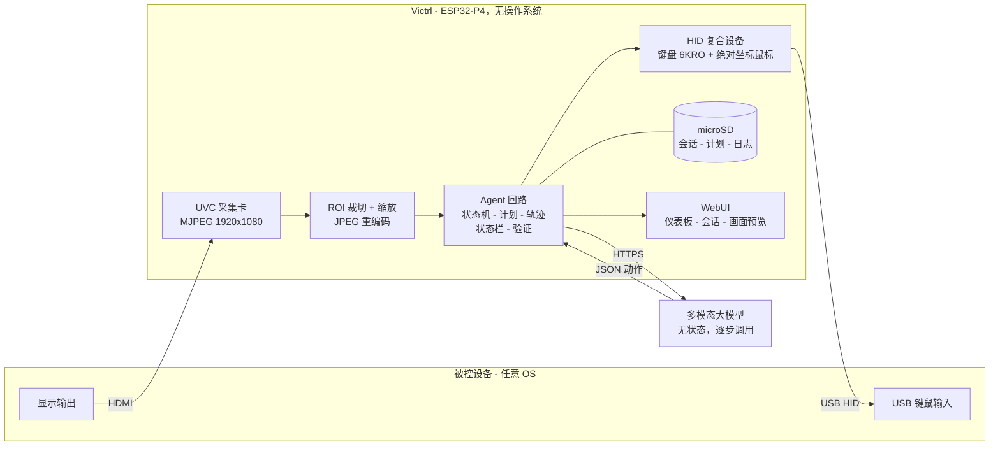

# Victrl

## 让自动化回归最原始的方式：**看见，点击，看见**

> [[English](README.md)|中文]

 -brightgreen)  

当今 AI Agent 依赖在目标设备上做软件层面的接入——API、无障碍层、ADB、VNC、RDP、驱动，或者在目标里跑一个 agent 进程。**Victrl 走的是相反的路：单个独立于被控系统的硬件设备**，用人的方式工作——看屏幕，按键。

```
采集画面  →  操作键鼠  →  观察结果
```

不在目标上安装、注入或读取任何东西。它以「普通显示输出接收端 + 标准 USB 键鼠」的形式接入，因此只要目标有视频输出和 USB 口就能用：**Windows、Linux、macOS、Android、工控机、嵌入式终端，以及那些任何软件 Agent 都进不去的又老又封闭的设备。** 这包括软件 Agent 根本做不到的事，比如改 BIOS 设置、无人值守装系统。

整个项目本质上是在探索一种新型架构：**Hardware AI Agent**。

> **本仓库是当前实现：agent 回路跑在 MCU 上。**

更早以前，同一套回路先在 Linux 上用 Python 验证过（采集卡 + 串口 HID 桥接）。那个原型证明了概念可行，已记录在 [`docs/Prototype.md`](docs/Prototype.md) 中——**它不是本仓库的代码**。这里放的是把整个 agent harness 压缩进一颗没有操作系统的单片机之后的版本。

---

## 「agent 回路跑在 MCU 上」的确切含义

LLM 是一个通过 HTTPS 调用的**无状态函数**。把无状态模型变成 agent 的一切，都在**设备上**：

- `感知 → 决策 → 执行` 状态机
- 轨迹（它的记忆）、计划、会话（对话窗口）存储
- 状态栏：光标位置、按住的鼠标键、锁定键状态、屏幕是否变化
- 验证与**失败分类**
- MJPEG 解码、感兴趣区域（ROI）裁切缩放、重编码与上传管线
- HID 合成，以及设备自带的 WebUI

板上没有 Linux、没有 Python、没有操作系统——ESP-IDF 6.0.1 + FreeRTOS，32MB PSRAM，一张 microSD 卡。云端 agent 框架把记忆放在服务器上；**这个把记忆放在设备上。**

## 价值特点

- **纯硬件。** 独立于目标的软件生态，它根本不知道 API 是什么。
- **即插即用。** 有视频输出和 USB 口的设备都能用——目标侧不需要预装、不需要 agent、不需要钩子或驱动，什么都不用配。
- **结构上无侵入。** 它读不到目标的文件、内存或磁盘，只能看见显示输出呈现的东西。
- **以当前登录账号身份操作。** 目标的权限模型、账号权限、登录状态全部照旧生效。Victrl 拿不到按键的人本来没有的任何权限。
- **自包含。** 一块板子、一个采集卡、一张 SD 卡，就是一个插上就能用的外设。
- **有实测，不是口号。** 下面每个数字都来自真实运行，而且**失败和成功一起公开**——见[最难的那部分](#最难的那部分)。

---

## 整体架构


```mermaid
graph LR
    subgraph Target["被控设备 - 任意 OS"]
        Screen[显示输出]
        HIDin[USB 键鼠输入]
    end

    subgraph Victrl["Victrl - ESP32-P4，无操作系统"]
        UVC["UVC 采集卡<br/>MJPEG 1920x1080"]
        Prep["ROI 裁切 + 缩放<br/>JPEG 重编码"]
        Loop["Agent 回路<br/>状态机 - 计划 - 轨迹<br/>状态栏 - 验证"]
        HIDout["HID 复合设备<br/>键盘 6KRO + 绝对坐标鼠标"]
        SD[("microSD<br/>会话 - 计划 - 日志")]
        Web["WebUI<br/>仪表板 - 会话 - 画面预览"]
    end

    Cloud["多模态大模型<br/>无状态，逐步调用"]

    Screen -->|HDMI| UVC
    UVC --> Prep
    Prep --> Loop
    Loop --> HIDout
    HIDout -->|USB HID| HIDin
    Loop --- SD
    Loop --> Web
    Loop -->|HTTPS| Cloud
    Cloud -->|JSON 动作| Loop
```

> 这里只用了 **Mermaid 8 时代就存在的语法**：`-->`、`---`、纯文本边标签、带引号的节点文本。
> 双向箭头 `<-->` 是 Mermaid 9.4 才加入的，在部分编辑器内置的旧版渲染器里会报
> `Lexical error ... Unrecognized text`。

每一步：抓帧 → 按需裁切缩放到感兴趣区域 → 编码上传，连同文本状态栏与轨迹 → 收到 JSON 动作 → 经 HID 执行 → 观察结果。回路对 API 是无状态的，状态全部落在 SD 卡上。

---

## 实测数据

| | 真机实测 |
|---|---|
| 单步墙钟 | **3.8 – 6.8 s** |
| 其中 API 占比 | **64 – 91 %** |
| 吞吐 | 约 116 输出 token/s ⇒ **单步墙钟 ≈ 输出 token ÷ 116** |
| 请求体（整屏） | **406 KB** |
| 请求体（放大到某个区域） | **87 – 89 KB**（4.7×） |
| 全分辨率解码缓冲 | 6.2 MB，**已改为跨步缓存** |
| 轨迹存储 | 纯文本，**零历史截图** |

两个不那么直觉的结论：

**决定延迟的是输出 token，不是采集或编解码。** 给模型的文本字段设了明确预算后，输出降低 **43–58%**，API 时间降低 **15–25%**。任何图像管线的优化都远达不到这个量级。

**指令含糊就是延迟 bug。** 一条措辞含糊的多步指令让推理从约 60 token 涨到 **2326 token**，单步 **13.6 秒**，任何推理强度档位都拦不住。把话说清楚比调任何参数都值。

---

## 最难的那部分

用语言模型驱动 GUI 不是有意思的问题。有意思的是：**设备的输出是「字符级」的，而目标机可以重新解释这些字符。** 这个项目大部分工程量花在这里，而这部分也是它最有迁移价值的产出。

**中文输入法会静默吃掉数字。** 往记事本输入 `Vicrl-7391-A`，实际得到 `Vicrl--A`：设备报告 `queued=ALL 12/12`（每个键事件都发出去了），而应用自己的状态栏显示 8 个字符。字母、连字符、空格、标点**全部完好**——**只有数字被吃掉**，主键盘数字行如此，**小键盘也一样**（已实测，Num Lock 确认开启）。

**盲目切换比不切换更糟。** `shift` 和 `ctrl+space` 翻转的是**同一个**状态。模型被告知「先试 shift，不行再试 ctrl+space」，于是连切两次，**回到原点**——一个丢掉的数字就这样升级成一段不断自我加剧的恢复循环。而输入模式是**设备观察不到的奇偶量**。

**解法是探针——但探针的「时机」和探针本身一样重要。** 打一个 2 字符探针 `a1`，读应用**自己报的字符数**：`a1` 说明模式对了，只剩 `a` 说明没对。这就把一个不可观测的奇偶量变成了**可测量的状态**。但连续三次切换、每次探针都和切换放在**同一批**里，全都显示失败——而紧接着一次完全不带切换的多词输入却完好通过。**切换其实一直是有效的**，只是探针在异步生效的模式切换落地**之前**就发出去了。这里的**假阴性比没有探针更贵**。

**同一个症状，相反的修法**——这是 harness 现在自己做的分类，也是我们犯过的最贵的错误：

| 判据 | 真正的原因 | 修法 |
|---|---|---|
| `queued < len` | 设备根本没发出去 | 传输 / HID 问题 |
| 动作后**屏幕完全没变** | 按键没到达目标控件——**焦点问题** | 点进控件，然后重打 |
| 屏幕**变了**但文字不对 | 字符在目标机被**重新解释** | 换输入**通道**，而不是加大重试次数 |

完整复盘（含日志）见[失败分类学](docs/Failure-Taxonomy.md)与[输入法问题记录](docs/Input-Method-Troubles.md)。

---

## 硬件


*三件套。左上：NV3007 142×428 SPI 屏。右上：按键板——不开浏览器就能开始、暂停、中止。下方：Waveshare ESP32-P4-WIFI6-DEV-KIT。*


*接好的样子。采集卡插在 P4 的 USB Host 口，读目标机的 HDMI 输出；P4 在另一侧以一个普通键鼠的身份出现。*

| 部件 | 作用 |
|---|---|
| **ESP32-P4** —— 双核 RISC-V，32MB PSRAM，16MB Flash | 整个 agent |
| **ESP32-C6** 经 SDIO（ESP-Hosted） | WiFi |
| **MS2109** USB 采集卡 | MJPEG 1920×1080 —— agent 的眼睛 |
| **TinyUSB** 复合 HID | 键盘（6KRO，1ms 间隔）+ 绝对坐标鼠标（0…32767） |
| **NV3007** 142×428 SPI LCD | 设备侧状态显示 |
| 按键板（GPIO0 / GPIO1） | 开始 · 暂停 · 中止，不开浏览器 |
| microSD（FAT32） | 会话、计划、轨迹、任务日志 |

---

## 快速开始

```bash
cp sdcard/config.example.json sdcard/config.json   # 填入 API key 与 WiFi 凭据
# 把 sdcard/ 拷到 FAT32 microSD 卡
# 用 ESP-IDF 6.0.1 编译烧录
```

`config.json` 已被 git 忽略——它含活凭据，模板是 [`sdcard/config.example.json`](sdcard/config.example.json)。

设备会自己起一个 WebUI：仪表板、会话（对话窗口）、实时画面预览、SD 卡文件浏览，以及**每步耗时分解**（`total / capture / prep(setup,dec,rs,enc) / connect / http / parse / sdlog / exec / sleep`）。单步慢的时候第一个该看的就是它——本页所有数字也都是这样测出来的。

完整技术文档：[`docs/技术文档.md`](docs/技术文档.md)（比本页详细得多）。

---

## 它**不**做什么

- **它不是软件 Agent。** 它无法在目标内部运行、读不到目标文件、调用不了目标 API。**如果你能在目标上装软件，就用软件方案**——更快也更强。
- **它需要有能采集的视频输出。** 没有显示输出、DRM 保护的视频、或画面到不了采集卡的设备，它无能为力。
- **它需要目标接受一个 USB 键盘。** 蓝牙 HID 是自然的扩展方向，目前实现的是 USB。
- **它只能以当前登录账号身份操作，仅此而已。** 无人值守停在锁屏的机器，它过不去——这是设计使然，它没有绕过能力。
- **中文输入法是真实限制。** 中文模式下往 GUI 文本框里打数字会被吃掉。有绕法；但如果任务**必须**在这类机器的文本框里输入数字，就是被阻塞的。
- **延迟取决于模型**，而且需要网络和 API key。
- 没有音频，没有文件传输，除按键外没有剪贴板集成。

---

## 注意

Victrl 将「视觉自动化」从软件方案变成了硬件外设：它以普通的显示输出接收端 + 标准 USB 键鼠的形式接入被控设备。项目不包含任何漏洞利用、口令或签名绕过，也没有以规避安全机制为目的的逻辑——它既不「侵入」系统，也不读取系统内存储的数据，只能通过显示输出「看见」目标。

由于被控设备会把它当作普通键鼠，它可以执行**任何当前登录用户可以执行的键鼠操作**，包括但不限于：**启动命令、删除文件、修改系统设置、下载软件**。同时，被控设备自身的权限模型、账号权限与登录状态依然生效：Victrl 是以**当前已登录账号**的身份在操作，而不是更高权限的身份。

由此有两条不可逾越的边界，属于使用者的责任，而非项目的责任：

- **只连接已获授权的目标。** 只在你拥有、或已被明确书面授权操作的设备上使用 Victrl。未经授权接入他人设备，或在授权被撤回后继续控制该设备，可能构成非法侵入或非法控制计算机信息系统。
- **物理管控设备。** 任何能接触到已配置好的 Victrl 的人，都可以通过它操作被控设备。请保持对设备的物理控制，并只从可信来源获取任务配置。

### 使用原则（具有约束力）

1. **仅限授权使用。** 允许：你本人拥有或合法占有的设备；设备所有权人或管理人已给出**事前书面授权**的企业自动化、测试、运维、无障碍或遗留系统场景。禁止：任何**未经授权**地访问或控制他人计算机信息系统、获取其中数据，或未经授权接入第三方设备。
2. **不用于隐蔽。** 不得用 Victrl 隐藏其在目标上的存在或行为，也不得用于破坏被控设备的安全控制。
3. **不用于非法目的。** 不得用于获取他人账号口令、验证码或个人信息，不得用于诈骗，不得用于投放恶意软件。
4. **责任自负。** 操作者须自行确保使用行为符合适用法律（在中国大陆，尤其是《刑法》第285条、第286条与《网络安全法》第27条）以及目标设备的许可协议与内部制度。

项目本身不包含任何恶意逻辑，发布目的在于研究与合法的自动化。维护者不提供、也不认可任何未经授权控制他人设备的用法。

**连接任何设备之前，请先阅读[《合规与授权说明》](docs/合规与授权说明.md)。** 文中说明了法律框架、入罪门槛、按场景的风险矩阵，以及让这类项目站在正确一侧的工程实践。

---

## 文档

| | |
|---|---|
| [`docs/技术文档.md`](docs/技术文档.md) | 完整技术文档——架构、各组件、完整决策记录 |
| [`docs/Failure-Taxonomy.md`](docs/Failure-Taxonomy.md) | 失败分类学：如何区分「没到达」和「被重新解释」 |
| [`docs/Input-Method-Troubles.md`](docs/Input-Method-Troubles.md) | 输入法问题始末，包括仍未解决的部分 |
| [`docs/Prototype.md`](docs/Prototype.md) · [`docs/MCU-Port.md`](docs/MCU-Port.md) | Linux/Python 原型，以及把回路搬进芯片真正花掉的代价 |
| [`docs/合规与授权说明.md`](docs/合规与授权说明.md) · [`docs/Compliance.md`](docs/Compliance.md) | 合规与授权说明（中文 / English） |

## 许可证与免责声明

Victrl 使用 **Apache 2.0 License** 开源。本项目仅供研究、自动化以及**已获合法授权**的操作使用。使用者须自行承担因自动化操作可能违反目标设备软件许可协议的风险。禁止将 Victrl 用于破解、侵入、未经授权控制计算机信息系统等任何非法活动。Apache 2.0 仅授予著作权层面的许可，**不能、也不可能免除任何人的刑事或行政责任**。

作者及贡献者不对因使用本软件产生的任何直接、间接、偶然、特殊或惩罚性损害承担责任，包括但不限于数据丢失、系统损坏、业务中断或违反第三方服务条款。

------

> *它不读取你的内存，不占据你的设备——它只是安静地看着屏幕，然后像人一样替你按下键盘。*
